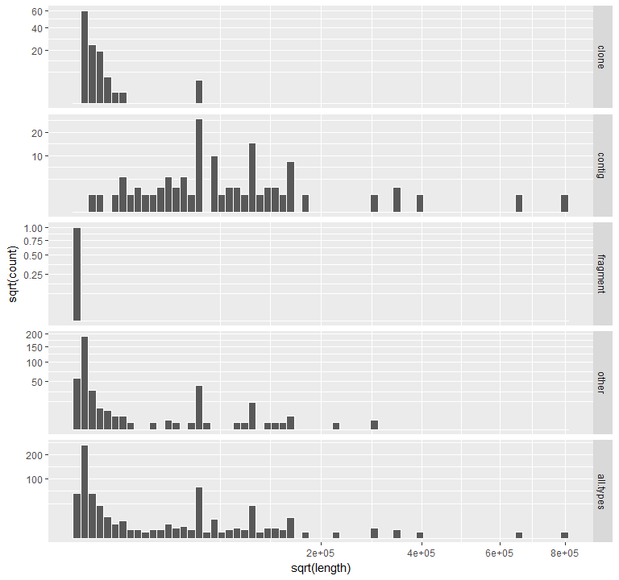
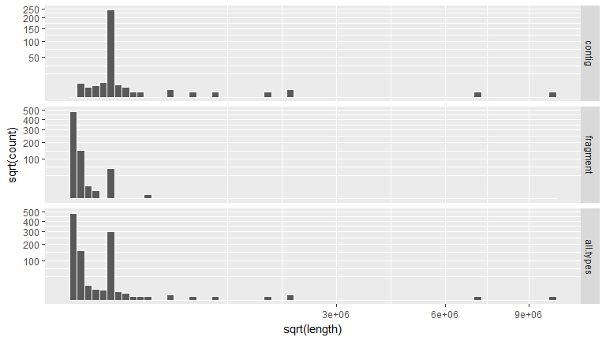
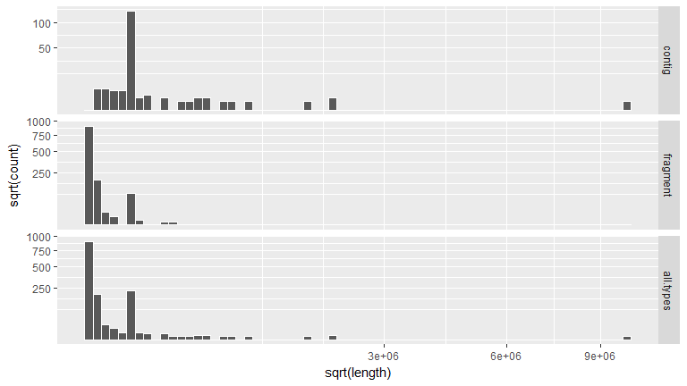
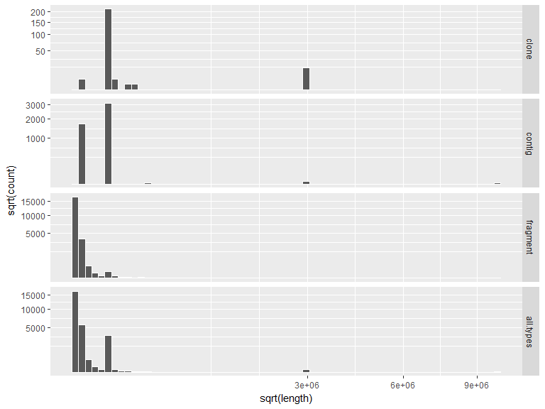
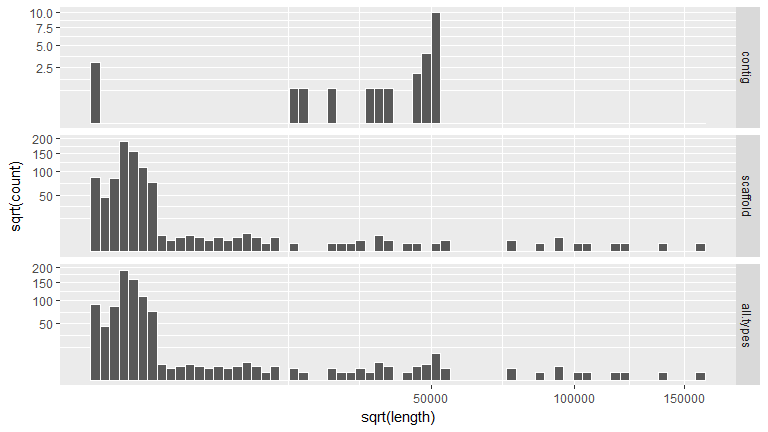
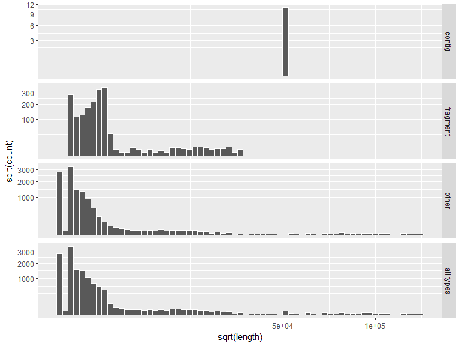
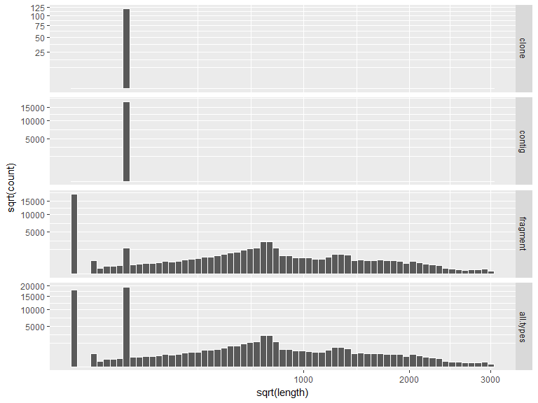
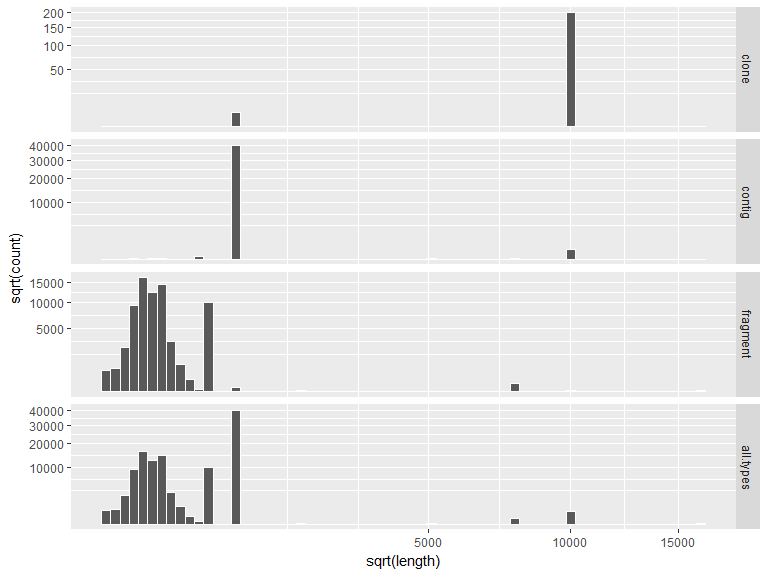

# Genome Assembly Gaps
Ronica K  


# Mouse Genome Assemblies

## GRCm38/mm10 (Dec. 2011)


```
## GRanges object with 686 ranges and 3 metadata columns:
##               seqnames               ranges strand |   status       type   bridge
##                  <Rle>            <IRanges>  <Rle> | <factor>   <factor> <factor>
##     [1]           chr1 [       1,   100000]      * |        N   telomere       no
##     [2]           chr1 [  100001,   110000]      * |        N  short_arm       no
##     [3]           chr1 [  110001,  3000000]      * |        N centromere       no
##     [4]           chr1 [ 3002130,  3003118]      * |        N      other      yes
##     [5]           chr1 [22424868, 22424967]      * |        N      other      yes
##     ...            ...                  ...    ... .      ...        ...      ...
##   [682] chrUn_GL456393       [53788, 53887]      * |        N      clone      yes
##   [683] chrUn_GL456394       [ 1035,  2612]      * |        N      clone      yes
##   [684] chrUn_GL456394       [20897, 21977]      * |        N      clone      yes
##   [685] chrUn_GL456396       [ 7730,  8220]      * |        N      clone      yes
##   [686] chrUn_GL456396       [11697, 11940]      * |        N      clone      yes
##   -------
##   seqinfo: 44 sequences from mm10 genome
```

### Gap Types

__clone__ - gaps between clones.

__contig__ - gaps between map contigs, various sizes.

__telomere__ - 42 gaps for telomeres (100,000 Ns).

__centromere__ - 20 gaps for centromeres (size: 2,890,000 Ns).

__short_arm__ - 21 gaps for the short arm (10,000 Ns) at base positions 100,001-110,000 of each chromosome.

__other__ - sequence of Ns in the assembly that were not marked as gaps in the AGP assembly definition file, various sizes.

__fragment__ - a single gap of 31 bases in chrX_GL456233_random.


```
## 
## centromere      clone     contig   fragment      other  short_arm   telomere 
##         20        114        104          1        384         21         42
```

### Euchromatic Gap Size Distribution (Status=='Known')


```
##         clone contig fragment  other all.types
## Min.      100    717       31      1         1
## 1st Qu.   100  50000       31    100       100
## Median    343  55000       31    100       344
## Mean     2529  91290       31  15870     26330
## 3rd Qu.  1316 100000       31   1803     50000
## Max.    50000 800000       31 300000    800000
```

<!-- -->

## NCBI37/mm9 (July 2007)


```
## GRanges object with 1011 ranges and 3 metadata columns:
##              seqnames               ranges strand |   status       type   bridge
##                 <Rle>            <IRanges>  <Rle> | <factor>   <factor> <factor>
##      [1]         chr1 [       1,  3000000]      * |        N centromere       no
##      [2]         chr1 [22414949, 22415048]      * |        N   fragment      yes
##      [3]         chr1 [22423350, 22473349]      * |        N     contig       no
##      [4]         chr1 [24686639, 24736638]      * |        N   fragment       no
##      [5]         chr1 [75102131, 75118130]      * |        N     contig       no
##      ...          ...                  ...    ... .      ...        ...      ...
##   [1007] chrUn_random   [5884087, 5884186]      * |        N   fragment      yes
##   [1008] chrUn_random   [5892169, 5892268]      * |        N   fragment      yes
##   [1009] chrUn_random   [5894720, 5896266]      * |        N   fragment      yes
##   [1010] chrUn_random   [5897640, 5897925]      * |        N   fragment      yes
##   [1011] chrUn_random   [5898884, 5899265]      * |        N   fragment      yes
##   -------
##   seqinfo: 32 sequences from mm9 genome
```

### Gap Types

__fragment__ - gaps between the contigs of a draft clone.

__contig__ - gaps between map contigs.

__centromere__ - gaps from centromeres (3,000,000 Ns) or other large blocks of heterochromatin (size varies).


```
## 
## centromere     contig   fragment 
##         21        281        709
```

### Euchromatic Gap Size Distribution (Status=='Known')


```
##           contig fragment all.types
## Min.        1700       31 3.100e+01
## 1st Qu.    50000      100 1.000e+02
## Median     50000      100 7.065e+02
## Mean      138100     5087 4.285e+04
## 3rd Qu.    50000      998 5.000e+04
## Max.    10000000   222300 1.000e+07
```

<!-- -->

## NCBI36/mm8 (Feb. 2006)


```
## GRanges object with 1408 ranges and 3 metadata columns:
##              seqnames               ranges strand |   status       type   bridge
##                 <Rle>            <IRanges>  <Rle> | <factor>   <factor> <factor>
##      [1]         chr1 [       1,  3000000]      * |        N centromere       no
##      [2]         chr1 [22410019, 22410118]      * |        N   fragment      yes
##      [3]         chr1 [22418420, 22420785]      * |        N     contig       no
##      [4]         chr1 [24670818, 24670917]      * |        N   fragment      yes
##      [5]         chr1 [74988764, 75004763]      * |        N     contig       no
##      ...          ...                  ...    ... .      ...        ...      ...
##   [1404] chrUn_random   [1203868, 1253867]      * |        N     contig       no
##   [1405] chrUn_random   [1272966, 1322965]      * |        N     contig       no
##   [1406] chrUn_random   [1333015, 1383014]      * |        N     contig       no
##   [1407] chrUn_random   [1397960, 1447959]      * |        N     contig       no
##   [1408] chrUn_random   [1450045, 1500044]      * |        N     contig       no
##   -------
##   seqinfo: 29 sequences from mm8 genome
```

### Gap Types

__fragment__ - gaps between the contigs of a draft clone.

__contig__ - gaps between map contigs.

__centromere__ - gaps from centromeres (3,000,000 Ns) or other large blocks of heterochromatin (size varies).


```
## 
## centromere     contig   fragment 
##         21        169       1218
```

### Euchromatic Gap Size Distribution (Status=='Known')


```
##           contig fragment all.types
## Min.        1700    100.0       100
## 1st Qu.    50000    100.0       100
## Median     50000    100.0       100
## Mean      166200   4999.0     24640
## 3rd Qu.    50000    635.8      1992
## Max.    10000000 222300.0  10000000
```

<!-- -->

## NCBI35/mm7 (Aug. 2005)


```
## GRanges object with 26075 ranges and 3 metadata columns:
##               seqnames               ranges strand |   status     type   bridge
##                  <Rle>            <IRanges>  <Rle> | <factor> <factor> <factor>
##       [1]         chr1   [      1, 3000000]      * |        N    clone       no
##       [2]         chr1   [3276495, 3276594]      * |        N fragment      yes
##       [3]         chr1   [3284014, 3284371]      * |        N fragment      yes
##       [4]         chr1   [3287469, 3287568]      * |        N fragment      yes
##       [5]         chr1   [3295419, 3295518]      * |        N fragment      yes
##       ...          ...                  ...    ... .      ...      ...      ...
##   [26071] chrUn_random [12765471, 12766470]      * |        N   contig       no
##   [26072] chrUn_random [12768681, 12769680]      * |        N   contig       no
##   [26073] chrUn_random [12772252, 12773251]      * |        N   contig       no
##   [26074] chrUn_random [12774385, 12775384]      * |        N   contig       no
##   [26075] chrUn_random [12776860, 12777859]      * |        N   contig       no
##   -------
##   seqinfo: 39 sequences from mm7 genome; no seqlengths
```

### Gap Types

__fragment__ - gaps between the contigs of a draft clone.

__clone__ - gaps between clones in the same map contig.

__contig__ - gaps between map contigs.

__centromere__ - gaps from centromeres (3,000,000 Ns) or other large blocks of heterochromatin (size varies).


```
## 
## centromere      clone     contig   fragment 
##          1        240       4854      20980
```

### Euchromatic Gap Size Distribution (Status=='Known')


```
##           clone  contig fragment all.types
## Min.       5000 1.0e+03      100       100
## 1st Qu.   50000 1.0e+03      100       100
## Median    50000 5.0e+04      100       186
## Mean     247800 3.7e+04     1061     10020
## 3rd Qu.   50000 5.0e+04      473      1011
## Max.    3000000 1.0e+07   222300  10000000
```

<!-- -->

# Chicken Genome Assemblies

## Gallus_gallus-5.0/galGal5 (Dec. 2015)


```
## GRanges object with 1216 ranges and 3 metadata columns:
##          seqnames           ranges strand |   status     type   bridge
##             <Rle>        <IRanges>  <Rle> | <factor> <factor> <factor>
##      [1]     chr1 [  7205,   7304]      * |        U   contig       no
##      [2]     chr1 [ 18686,  18785]      * |        U   contig       no
##      [3]     chr1 [399948, 400047]      * |        U   contig       no
##      [4]     chr1 [437804, 437903]      * |        U   contig       no
##      [5]     chr1 [451315, 451396]      * |        N scaffold      yes
##      ...      ...              ...    ... .      ...      ...      ...
##   [1212] chrLGE64 [114642, 114741]      * |        U   contig       no
##   [1213] chrLGE64 [193129, 193228]      * |        U   contig       no
##   [1214] chrLGE64 [220263, 220362]      * |        U   contig       no
##   [1215] chrLGE64 [428978, 429077]      * |        U   contig       no
##   [1216] chrLGE64 [856252, 856351]      * |        U   contig       no
##   -------
##   seqinfo: 447 sequences from galGal5 genome
```

### Gap Types

__centromere__ - gaps for centromeres are included when they can be reasonably localized (count: 16; all of size 500,000 bases)

__contig__ - gaps between contigs in scaffolds (count: 381; size range: 10 - 50,000 bases)

__scaffold__ - gaps between scaffolds in chromosome assemblies (count: 819; size range: 13 - 156,025 bases)


```
## 
## centromere     contig   scaffold 
##         16        381        819
```

### Known vs Unknown Gap Size


```
## 
##   N   U 
## 859 357
```

__Status=='Known'__


```
## 
## centromere     contig   scaffold 
##         16         25        818
```

### Euchromatic Gap Size Distribution (Status=='Known')


```
##         contig scaffold all.types
## Min.        10     13.0        10
## 1st Qu.  33000    424.5       430
## Median   48570    766.5       790
## Mean     38290   3379.0      4415
## 3rd Qu.  50000   1271.0      1321
## Max.     50000 156000.0    156000
```

<!-- -->

## ICGSC Gallus_gallus-4.0/galGal4 (Nov. 2011)


```
## GRanges object with 13898 ranges and 3 metadata columns:
##                           seqnames           ranges strand |   status     type   bridge
##                              <Rle>        <IRanges>  <Rle> | <factor> <factor> <factor>
##       [1]                     chr1     [1034, 1133]      * |        U   contig       no
##       [2]                     chr1     [1635, 1734]      * |        U   contig       no
##       [3]                     chr1     [2505, 2604]      * |        U   contig       no
##       [4]                     chr1     [3124, 3223]      * |        U   contig       no
##       [5]                     chr1     [4729, 4828]      * |        U   contig       no
##       ...                      ...              ...    ... .      ...      ...      ...
##   [13894]                 chrLGE64 [791273, 791372]      * |        U   contig       no
##   [13895]                 chrLGE64 [792241, 792340]      * |        U   contig       no
##   [13896] chrLGE64_JH375238_random [  1763,   1862]      * |        U fragment      yes
##   [13897] chrLGE64_JH375239_random [  1769,   1868]      * |        U fragment      yes
##   [13898] chrLGE64_JH375239_random [  4383,   4482]      * |        U fragment      yes
##   -------
##   seqinfo: 1858 sequences from galGal4 genome; no seqlengths
```

### Gap Types

__fragment__ - gaps between the contigs of a draft clone. 

__contig__ - whole genome sequence contigs.

__other__ - sequences of gaps not marked in the assembly AGP files


```
## 
##   contig fragment    other 
##      915     1948    11035
```

### Known vs Unknown Gap Size


```
## 
##     N     U 
## 12768  1130
```

__Status=='Known'__


```
## 
##   contig fragment    other 
##       11     1722    11035
```

### Euchromatic Gap Size Distribution (Status=='Known')


```
##         contig fragment    other all.types
## Min.     50000    100.0      1.0         1
## 1st Qu.  50000    456.2      3.0       100
## Median   50000   1244.0    142.0       207
## Mean     50000   1833.0    929.6      1094
## 3rd Qu.  50000   1835.0    525.0       695
## Max.     50000  33330.0 131400.0    131400
```

<!-- -->

## WUGSC 2.1/galGal3 (May 2006)


```
## GRanges object with 78478 ranges and 3 metadata columns:
##                seqnames           ranges strand |   status     type   bridge
##                   <Rle>        <IRanges>  <Rle> | <factor> <factor> <factor>
##       [1]          chr1   [ 5231,  5240]      * |        N fragment      yes
##       [2]          chr1   [ 6541,  6550]      * |        N fragment      yes
##       [3]          chr1   [16469, 16478]      * |        N fragment      yes
##       [4]          chr1   [31259, 31358]      * |        N fragment      yes
##       [5]          chr1   [40054, 40360]      * |        N fragment      yes
##       ...           ...              ...    ... .      ...      ...      ...
##   [78474] chrE64_random [489602, 489765]      * |        N fragment      yes
##   [78475] chrE64_random [507128, 508059]      * |        N fragment      yes
##   [78476] chrE64_random [539187, 540173]      * |        N fragment      yes
##   [78477] chrE64_random [542104, 542113]      * |        N fragment      yes
##   [78478] chrE64_random [554482, 556165]      * |        N fragment      yes
##   -------
##   seqinfo: 52 sequences from galGal3 genome
```

### Gap Types

__fragment__ - gaps between the contigs of a draft clone. 

__clone__ - gaps between clones in the same map contig.

Two more types somehow left behind.


```
## 
## centromere      clone     contig   fragment 
##         18        119      17317      61024
```

### Euchromatic Gap Size Distribution (Status=='Known')


```
##         clone contig fragment all.types
## Min.      100    100     10.0      10.0
## 1st Qu.   100    100     10.0     100.0
## Median    100    100    524.0     151.0
## Mean      100    100    592.3     482.9
## 3rd Qu.   100    100    853.2     745.0
## Max.      100    100   2999.0    2999.0
```

<!-- -->

## WUGSC 1.0/galGal2 (Feb. 2004)


```
## GRanges object with 111817 ranges and 3 metadata columns:
##             seqnames         ranges strand |   status     type   bridge
##                <Rle>      <IRanges>  <Rle> | <factor> <factor> <factor>
##        [1]      chr1 [ 4782,  4963]      * |        N fragment      yes
##        [2]      chr1 [ 6985,  7224]      * |        N fragment      yes
##        [3]      chr1 [ 8579,  9178]      * |        N fragment      yes
##        [4]      chr1 [11437, 11548]      * |        N fragment      yes
##        [5]      chr1 [26706, 26851]      * |        N fragment      yes
##        ...       ...            ...    ... .      ...      ...      ...
##   [111813] chrE50C23 [ 1236,  1543]      * |        N fragment      yes
##   [111814] chrE50C23 [ 3665,  3877]      * |        N fragment      yes
##   [111815] chrE50C23 [ 7215,  7814]      * |        N fragment      yes
##   [111816] chrE50C23 [ 9035, 19034]      * |        N   contig       no
##   [111817] chrE50C23 [19796, 20072]      * |        N fragment      yes
##   -------
##   seqinfo: 51 sequences from galGal2 genome; no seqlengths
```

### Gap Types

__fragment__ - gaps between the Whole Genome Shotgun contigs of a supercontig. (In this context, a contig is a set of overlapping sequence reads. A supercontig is a set of contigs ordered and oriented during the Whole Genome Shotgun process using paired-end reads.) 
These are represented by varying numbers of Ns in the assembly. Fragment gap sizes are usually taken from read pair data.

__clone__ - gaps between supercontigs linked by the fingerprint map. In general, these are represented by 10,000 Ns in the assembly.

__contig__ - gaps between supercontigs not linked by the fingerprint map, but instead by marker data. (In this context, the "Contig" gap type refers to a map contig, not a sequence contig.) In general, these are represented by 10,000 Ns in the assembly for all chromosomes except chrUn (concatenation of unplaced supercontigs), where gaps of 1,000 Ns are used. Gaps of other sizes were used when mRNA or other data suggested possible but not confirmed links between supercontigs.

__centromere__ - gaps for centromeres were included when they could be reasonably localized. These are represented by 1,500,000 Ns in the assembly for the macrochromosomes 1-10 and Z, and by 500,000 Ns for all others (microchromosomes)


```
## 
## centromere      clone     contig   fragment 
##         16        201      40495      71105
```

### Euchromatic Gap Size Distribution (Status=='Known')


```
##         clone contig fragment all.types
## Min.     1000    100     10.0      10.0
## 1st Qu. 10000   1000    123.0     149.0
## Median  10000   1000    187.0     259.0
## Mean     9866   1071    240.2     558.4
## 3rd Qu. 10000   1000    238.0    1000.0
## Max.    10000  10000  16000.0   16000.0
```

<!-- -->


# Gaps & Rmsk Overlaps


## Mouse (mm10 Assembly)

### Number of Overlaps between Gaps and Rmsk Intervals


```
## [1] 71
```

### Subset of Gaps Overlaping Rmsk Intervals


```
## GRanges object with 71 ranges and 3 metadata columns:
##                    seqnames                 ranges strand |   status     type   bridge
##                       <Rle>              <IRanges>  <Rle> | <factor> <factor> <factor>
##    [1]                 chr1 [ 25909751,  25909751]      * |        N    other      yes
##    [2]                 chr1 [167685493, 167685502]      * |        N    other      yes
##    [3]                 chr1 [167817560, 167817569]      * |        N    other      yes
##    [4]                 chr1 [171228616, 171228616]      * |        N    other      yes
##    [5]                 chr1 [171228619, 171228619]      * |        N    other      yes
##    ...                  ...                    ...    ... .      ...      ...      ...
##   [67] chrX_GL456233_random       [194757, 194856]      * |        N    clone      yes
##   [68] chrX_GL456233_random       [235308, 235407]      * |        N    clone      yes
##   [69] chrX_GL456233_random       [287721, 287820]      * |        N    clone      yes
##   [70] chrX_GL456233_random       [300319, 300349]      * |        N fragment      yes
##   [71] chrX_GL456233_random       [310659, 310758]      * |        N    clone      yes
##   -------
##   seqinfo: 44 sequences from mm10 genome
```

### Subset of Rmsk Intervals Overlaping Gaps

Some Rmsk intervals seem to overlap multiple gaps 


```
## GRanges object with 62 ranges and 3 metadata columns:
##                    seqnames                 ranges strand |           name         class         family
##                       <Rle>              <IRanges>  <Rle> |       <factor>      <factor>       <factor>
##    [1]                 chr1 [ 25909724,  25909753]      + |           (T)n Simple_repeat  Simple_repeat
##    [2]                 chr1 [167685412, 167685581]      + |          (CA)n Simple_repeat  Simple_repeat
##    [3]                 chr1 [167817421, 167817603]      - |       RMER17D2           LTR           ERVK
##    [4]                 chr1 [171228594, 171228645]      + |         G-rich Simple_repeat Low_complexity
##    [5]                 chr1 [171424103, 171424251]      + |        B1_Mus2          SINE            Alu
##    ...                  ...                    ...    ... .            ...           ...            ...
##   [58] chrX_GL456233_random       [194420, 195064]      + |        L1_Mus3          LINE             L1
##   [59] chrX_GL456233_random       [234747, 236977]      - |        L1_Mus1          LINE             L1
##   [60] chrX_GL456233_random       [287540, 292278]      - |         L1Md_T          LINE             L1
##   [61] chrX_GL456233_random       [297242, 301568]      + |        L1Md_F2          LINE             L1
##   [62] chrX_GL456233_random       [308909, 310817]      - | MurERV4_19-int           LTR           ERVK
##   -------
##   seqinfo: 66 sequences from mm10 genome
```

### Number of Gaps Completely Covered (like 146%) by Rmsk Intervals


```
## [1] 71
```

### Overlaping Interval Pairs


```
## Pairs object with 71 pairs and 0 metadata columns:
##                                     first                               second
##                                 <GRanges>                            <GRanges>
##    [1]             chr1:25909751-25909751             chr1:25909724-25909753:+
##    [2]           chr1:167685493-167685502           chr1:167685412-167685581:+
##    [3]           chr1:167817560-167817569           chr1:167817421-167817603:-
##    [4]           chr1:171228616-171228616           chr1:171228594-171228645:+
##    [5]           chr1:171228619-171228619           chr1:171228594-171228645:+
##    ...                                ...                                  ...
##   [67] chrX_GL456233_random:194757-194856 chrX_GL456233_random:194420-195064:+
##   [68] chrX_GL456233_random:235308-235407 chrX_GL456233_random:234747-236977:-
##   [69] chrX_GL456233_random:287721-287820 chrX_GL456233_random:287540-292278:-
##   [70] chrX_GL456233_random:300319-300349 chrX_GL456233_random:297242-301568:+
##   [71] chrX_GL456233_random:310659-310758 chrX_GL456233_random:308909-310817:-
```

## Chicken (galGal5 Assembly)

### Number of Overlaps between Gaps and Rmsk Intervals


```
## [1] 40
```

### Subset of Gaps Overlaping Rmsk Intervals


```
## GRanges object with 40 ranges and 3 metadata columns:
##                       seqnames                 ranges strand |   status     type   bridge
##                          <Rle>              <IRanges>  <Rle> | <factor> <factor> <factor>
##    [1]                    chr1 [  9033091,   9033190]      * |        U   contig       no
##    [2]                    chr1 [ 43492265,  43492364]      * |        U   contig       no
##    [3]                    chr1 [ 83170188,  83170223]      * |        N scaffold      yes
##    [4]                    chr1 [106770471, 106770570]      * |        U   contig       no
##    [5]                    chr2 [ 97750141,  97750240]      * |        U   contig       no
##    ...                     ...                    ...    ... .      ...      ...      ...
##   [36]       chrUn_NT_477194v1           [1734, 1776]      * |        N scaffold      yes
##   [37]       chrUn_NT_477781v1           [ 787,  822]      * |        N scaffold      yes
##   [38]       chrUn_NT_478291v1           [ 857,  892]      * |        N scaffold      yes
##   [39] chr6_NT_461060v1_random           [ 591,  626]      * |        N scaffold      yes
##   [40] chrZ_NT_463816v1_random           [7848, 8194]      * |        N scaffold      yes
##   -------
##   seqinfo: 447 sequences from galGal5 genome
```

### Subset of Rmsk Intervals Overlaping Gaps


```
## GRanges object with 36 ranges and 3 metadata columns:
##                       seqnames                 ranges strand |         name         class        family
##                          <Rle>              <IRanges>  <Rle> |     <factor>      <factor>      <factor>
##    [1]                    chr1 [  9027991,   9034501]      + |    (AGGGTT)n Simple_repeat Simple_repeat
##    [2]                    chr1 [ 43490080,  43494183]      + |    (GGTTAG)n Simple_repeat Simple_repeat
##    [3]                    chr1 [ 83167957,  83171090]      + | (AACAACGCA)n Simple_repeat Simple_repeat
##    [4]                    chr1 [106769537, 106771836]      + |     (GAGGA)n Simple_repeat Simple_repeat
##    [5]                    chr2 [ 97748201,  97752160]      + |    (CTAACC)n Simple_repeat Simple_repeat
##    ...                     ...                    ...    ... .          ...           ...           ...
##   [32]       chrUn_NT_477194v1           [   1, 2617]      + |    (TTAGGG)n Simple_repeat Simple_repeat
##   [33]       chrUn_NT_477781v1           [ 625,  950]      + |       GGXHOI Simple_repeat  W-chromosome
##   [34]       chrUn_NT_478291v1           [ 538, 1202]      + |       GGXHOI Simple_repeat  W-chromosome
##   [35] chr6_NT_461060v1_random           [   7, 1828]      + |    (TGTAGA)n Simple_repeat Simple_repeat
##   [36] chrZ_NT_463816v1_random           [6717, 8764]      + | GGERVL-B-int           LTR          ERVL
##   -------
##   seqinfo: 22168 sequences from galGal5 genome
```

### Number of Gaps Completely Covered by Rmsk Intervals


```
## [1] 40
```

### Overlaping Interval Pairs


```
## Pairs object with 40 pairs and 0 metadata columns:
##                                    first                              second
##                                <GRanges>                           <GRanges>
##    [1]              chr1:9033091-9033190              chr1:9027991-9034501:+
##    [2]            chr1:43492265-43492364            chr1:43490080-43494183:+
##    [3]            chr1:83170188-83170223            chr1:83167957-83171090:+
##    [4]          chr1:106770471-106770570          chr1:106769537-106771836:+
##    [5]            chr2:97750141-97750240            chr2:97748201-97752160:+
##    ...                               ...                                 ...
##   [36]       chrUn_NT_477194v1:1734-1776          chrUn_NT_477194v1:1-2617:+
##   [37]         chrUn_NT_477781v1:787-822         chrUn_NT_477781v1:625-950:+
##   [38]         chrUn_NT_478291v1:857-892        chrUn_NT_478291v1:538-1202:+
##   [39]   chr6_NT_461060v1_random:591-626    chr6_NT_461060v1_random:7-1828:+
##   [40] chrZ_NT_463816v1_random:7848-8194 chrZ_NT_463816v1_random:6717-8764:+
```
