# Repeat Classes
Ronica K  


__UCSC RepeatMasker GRanges__


```
## GRanges object with 5232237 ranges and 3 metadata columns:
##             seqnames               ranges strand |        name       class
##                <Rle>            <IRanges>  <Rle> | <character> <character>
##         [1]     chr1 [16777161, 16777470]      + |       AluSp        SINE
##         [2]     chr1 [25165801, 25166089]      - |        AluY        SINE
##         [3]     chr1 [33553607, 33554646]      + |         L2b        LINE
##         [4]     chr1 [50330064, 50332153]      + |      L1PA10        LINE
##         [5]     chr1 [58720068, 58720973]      - |       L1PA2        LINE
##         ...      ...                  ...    ... .         ...         ...
##   [5232233]    chr22 [51243195, 51243802]      - |        L1MC        LINE
##   [5232234]    chr22 [51243819, 51243924]      + |       LTR60         LTR
##   [5232235]    chr22 [51244036, 51244339]      + |      AluYb8        SINE
##   [5232236]    chr22 [51244340, 51244456]      + |       LTR60         LTR
##   [5232237]    chr22 [51244457, 51244541]      + |       LTR60         LTR
##                  family
##             <character>
##         [1]         Alu
##         [2]         Alu
##         [3]          L2
##         [4]          L1
##         [5]          L1
##         ...         ...
##   [5232233]          L1
##   [5232234]        ERV1
##   [5232235]         Alu
##   [5232236]        ERV1
##   [5232237]        ERV1
##   -------
##   seqinfo: 24 sequences from hg19 genome
```

__Repeats across chromosomes__

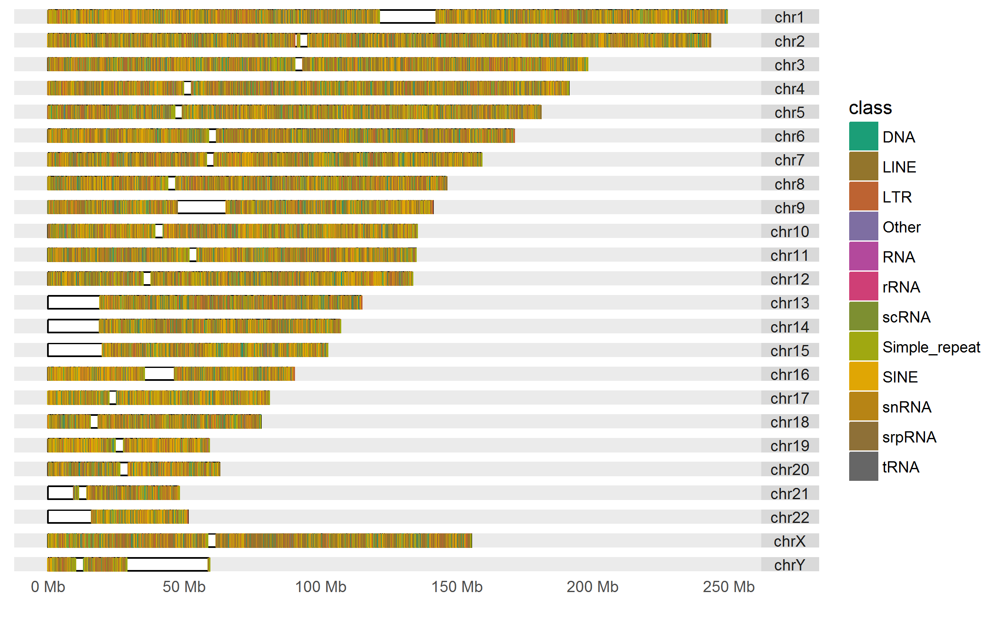<!-- -->

__Repeats on chromosome Y__

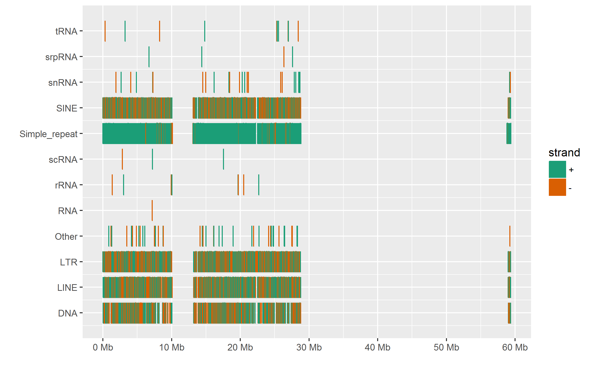<!-- -->

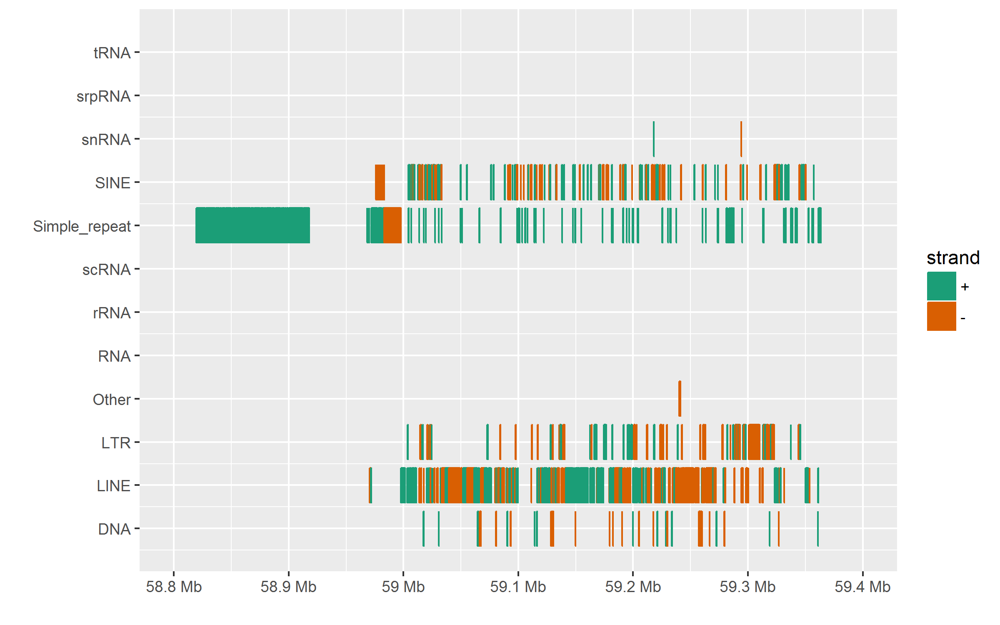<!-- -->

__Overlaps between repeat classes__


```
##    class1        class2 num.overlaps
## 1    SINE          LINE         6777
## 2    SINE           LTR          207
## 3    SINE           DNA          233
## 4    SINE Simple_repeat           15
## 5    SINE         Other           14
## 6    SINE         snRNA            3
## 7    SINE          tRNA            3
## 8    SINE        srpRNA           20
## 9    SINE          rRNA            9
## 10   LINE           LTR            5
## 11   LINE           DNA           97
## 12   LINE Simple_repeat            4
## 13   LINE          rRNA           16
## 14    LTR           DNA          808
## 15    LTR Simple_repeat          215
## 16    LTR         Other           11
## 17    LTR         snRNA           24
## 18    LTR          tRNA            5
## 19    LTR        srpRNA            3
## 20    LTR          rRNA            7
## 21    LTR         scRNA            5
## 22    LTR           RNA            8
## 23    DNA         Other            7
## 24    DNA         snRNA           23
## 25    DNA          tRNA            5
## 26    DNA        srpRNA            6
## 27    DNA          rRNA            6
## 28    DNA         scRNA            6
## 29    DNA           RNA            6
## 30  Other         snRNA            1
```

###Repeats


```
##               num.ranges genome.covered.Mb
## DNA               456948         98.275783
## LINE             1480369        631.141049
## LTR               708210        264.167042
## Other              15422          6.109487
## RNA                  718          0.118748
## rRNA                1723          0.175318
## scRNA               1291          0.122042
## Simple_repeat     790203         55.563959
## SINE             1769839        391.666614
## snRNA               4285          0.337551
## srpRNA              1456          0.263136
## tRNA                1773          0.102771
```

__Length distribution__


```
##      length        
##  Min.   :     6.0  
##  1st Qu.:    91.0  
##  Median :   188.0  
##  Mean   :   276.8  
##  3rd Qu.:   306.0  
##  Max.   :160602.0
```

__Max length__


```
## GRanges object with 1 range and 3 metadata columns:
##       seqnames               ranges strand |        name         class
##          <Rle>            <IRanges>  <Rle> | <character>   <character>
##   [1]     chr7 [61087754, 61248355]      + |   ALR/Alpha Simple_repeat
##            family
##       <character>
##   [1]       centr
##   -------
##   seqinfo: 24 sequences from hg19 genome
```

__Square root axes, red median__

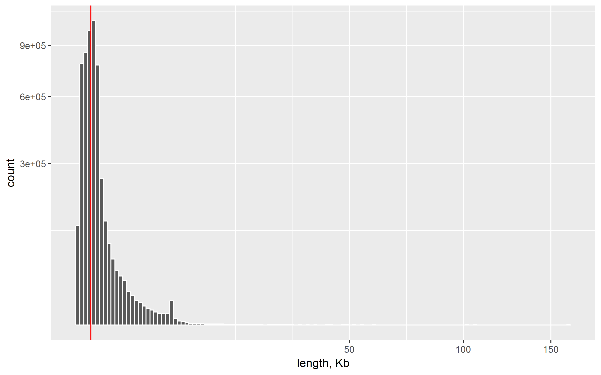<!-- -->

__Length distribution by class__


```
##            DNA   LINE   LTR  Other   RNA   rRNA  scRNA Simple_repeat  SINE
## Min.      11.0   11.0    11   11.0  29.0   16.0  13.00          6.00  11.0
## 1st Qu.   97.0  115.0   154  115.0 104.0   44.0  86.00         27.00 140.0
## Median   158.0  221.0   334  180.0 162.0   85.0  99.00         37.00 255.0
## Mean     215.1  426.3   373  396.2 165.4  101.8  94.53         70.32 221.3
## 3rd Qu.  231.0  448.0   438  379.0 235.0  106.0 107.00         58.00 300.0
## Max.    3625.0 8505.0 18040 2435.0 339.0 2986.0 200.00     160600.00 614.0
##          snRNA srpRNA   tRNA
## Min.     11.00  11.00  26.00
## 1st Qu.  42.00  73.75  38.00
## Median   75.00 166.00  65.00
## Mean     78.78 180.70  57.96
## 3rd Qu. 105.00 300.00  73.00
## Max.    228.00 369.00 109.00
```


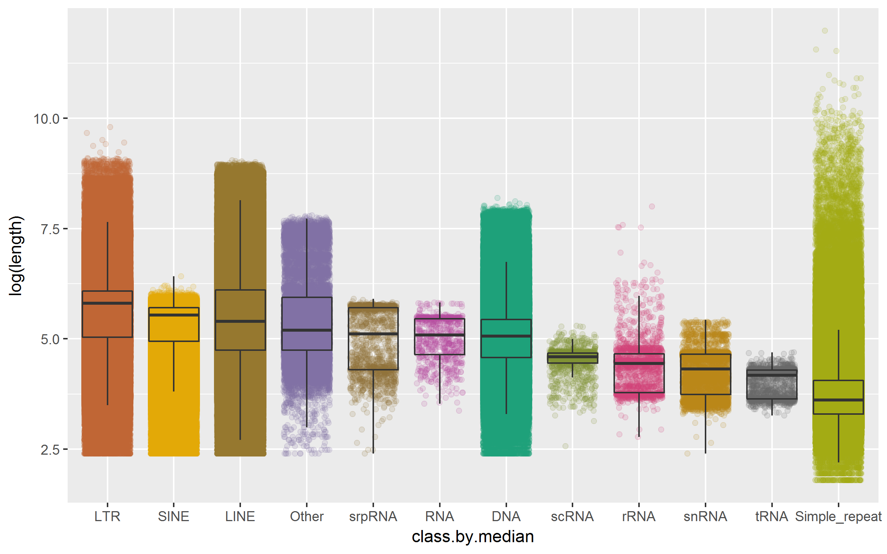<!-- -->


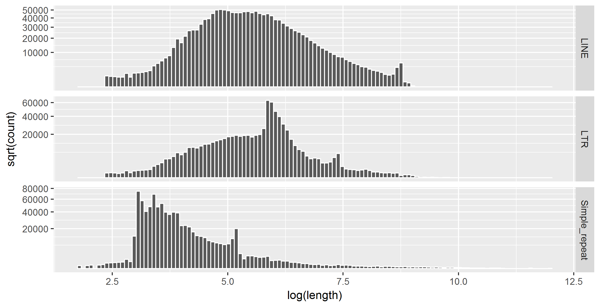<!-- -->


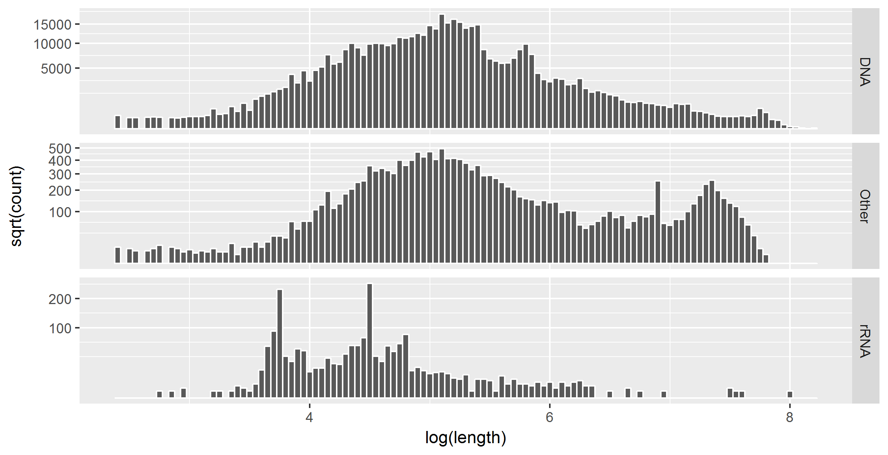<!-- -->


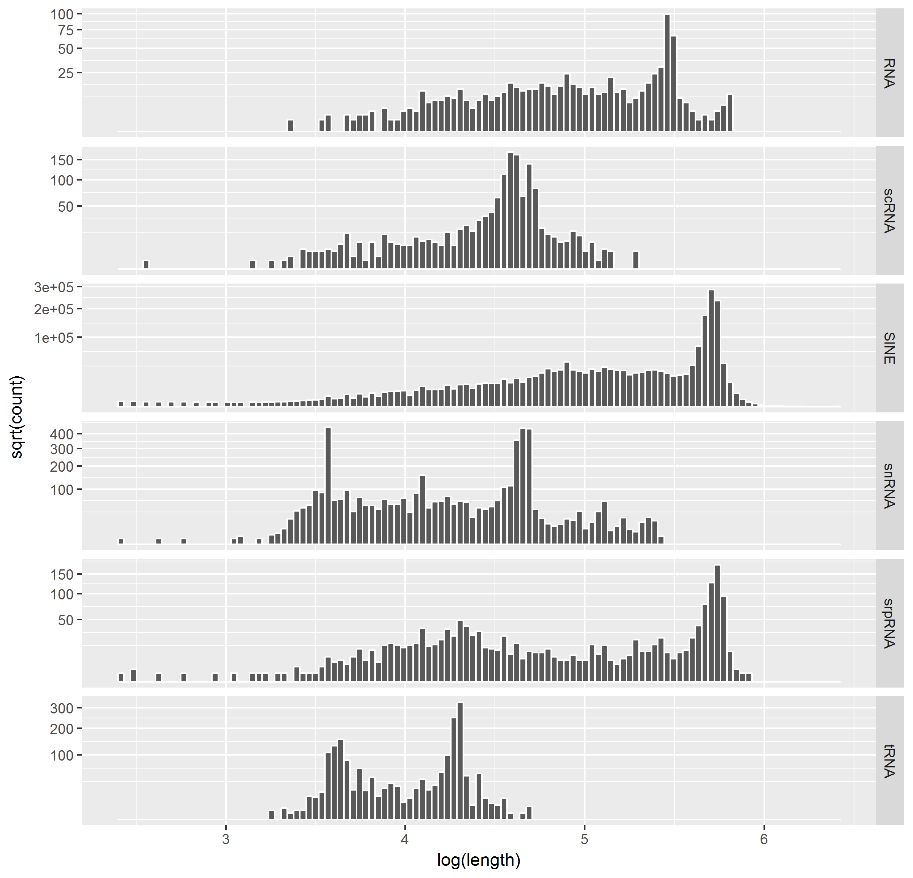<!-- -->

__Length distribution by class and chromosome__


```
##           DNA     LINE      LTR  Other   RNA  rRNA scRNA Simple_repeat
## chr1  7561760 47822744 19512938 573743  8943 15919 11001       3356091
## chr2  8656034 52335771 21105960 514696 10026 16584  9892       3839294
## chr3  7424220 44564136 18508231 420350  7924  9611  7196       2900167
## chr4  6641167 44925422 20878188 347111  8187  8080  6767       3225699
## chr5  6469882 41407677 17167149 361433  7883  9744  6550       3190865
## chr6  6066997 37941374 15601142 347863  8658  9568  5978       2641211
## chr7  5241629 33052792 13395164 335103  6562  7088  8057       3720246
## chr8  4931223 32150107 13877065 259345  6351  9240  4112       3213477
## chr9  4081457 26329288 10457173 274257  5729  5754  4976       2258544
## chr10 4595885 26932074 10791552 282562  6178  6808  5250       2355765
## chr11 4247230 29788456 11536940 291763  5587  8222  5065       3015086
## chr12 4651319 27764949 11996766 273505  5998  8657  8151       2824080
## chr13 3290242 21138313  9682409 170137  4115  3718  3724       1595267
## chr14 3024798 19022033  8286282 198660  4009  3561  4707       1492359
## chr15 2863986 17148955  6016494 178035  2903  4139  4065       1150151
## chr16 2639247 12579795  6169731 157379  2558 10767  3452       2044220
## chr17 2420612 11862549  4900244 204022  2046  5121  5674       1323442
## chr18 2594647 16012466  6730963 133368  2320  2920  2498       1218814
## chr19 1202991  7660618  4826643 178381   591 10223  3229       2370362
## chr20 2460543 11313254  5109132 153602  3561  2336  2692       1093517
## chr21 1121736  6661239  4078389  49761   810  2749   731        920663
## chr22  939884  5359638  2235840  81580  2434  1807  2174        824354
## chrX  4702833 50898657 16781062 298872  5131  8567  5792       3016977
## chrY   445461  6468742  4521585  23959   244  4135   309       1973308
##           SINE snRNA srpRNA  tRNA
## chr1  35211677 37018  24946 17098
## chr2  28543440 25949  19104  5776
## chr3  23700454 23658  17108  4211
## chr4  19351448 18901  13518  3142
## chr5  20239908 18584  12771  4367
## chr6  19555620 20950  13361 18884
## chr7  21894269 16245  12677  6323
## chr8  17306934 15068  12171  3397
## chr9  16986244 12125  11390  2513
## chr10 18658703 14972  10831  3271
## chr11 17911705 13046   9617  4487
## chr12 19741382 16063  10933  3275
## chr13  9709321  7980   8765  1715
## chr14 12089543 10778  10217  3401
## chr15 12694326 12425  12020  1918
## chr16 16181890  9877   5560  3656
## chr17 17385250 14454  14208  4493
## chr18  8284396  9450   6150  1208
## chr19 15924390  5409  10296  2030
## chr20  9902562  7277   7819  1169
## chr21  3960112  4253   1952   582
## chr22  7794505  4161   7113   685
## chrX  16037153 16167   9895  4543
## chrY   2601382  2741    714   627
```


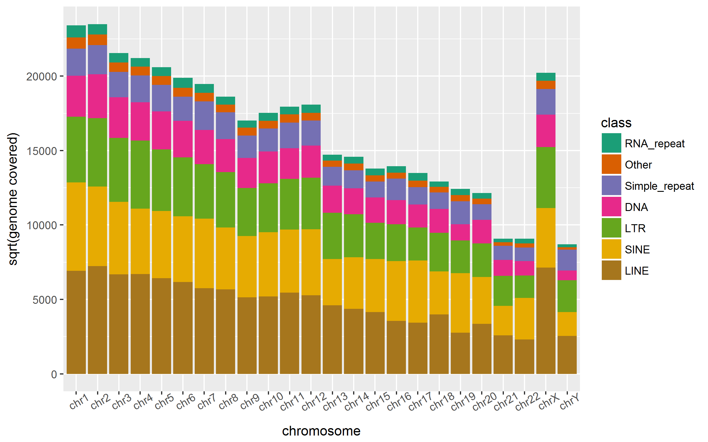<!-- -->

###Gaps


__Gap length distribution (no flanks)__


```
##      length        
##  Min.   :       1  
##  1st Qu.:     267  
##  Median :     902  
##  Mean   :    6856  
##  3rd Qu.:    3010  
##  Max.   :33071136
```

__Square root axes, red median__

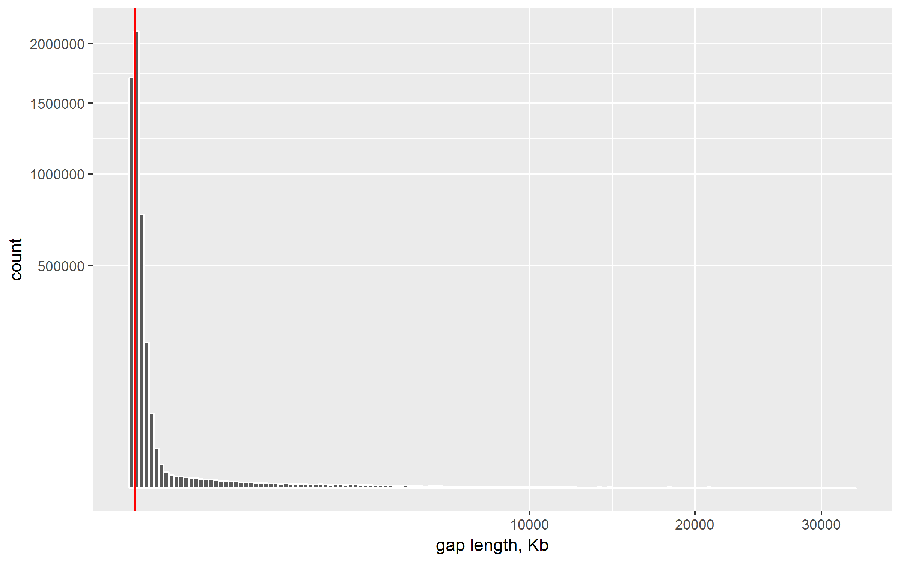<!-- -->

```
##              DNA     LINE      LTR    Other      RNA     SINE
## Min.           1        1        1        1       17        1
## 1st Qu.      478      195      271    20910   906600      198
## Median      2924      517     1253   102000  2468000      672
## Mean        6644     1735     4397   196200  3758000     1575
## 3rd Qu.     8463     2007     4872   256000  5075000     1762
## Max.    30240000 30190000 30230000 30920000 33070000 30190000
##         Simple_repeat     rRNA    scRNA    snRNA   srpRNA     tRNA
## Min.                1        2       11        2        1       19
## 1st Qu.           628   324400   304900   121700   261200    10170
## Median           2107  1018000  1107000   372400  1011000   620200
## Mean             3850  1688000  2233000   699400  1998000  1628000
## 3rd Qu.          5000  2325000  2935000   898700  2562000  2285000
## Max.         30000000 29040000 28970000 30530000 32510000 32150000
```


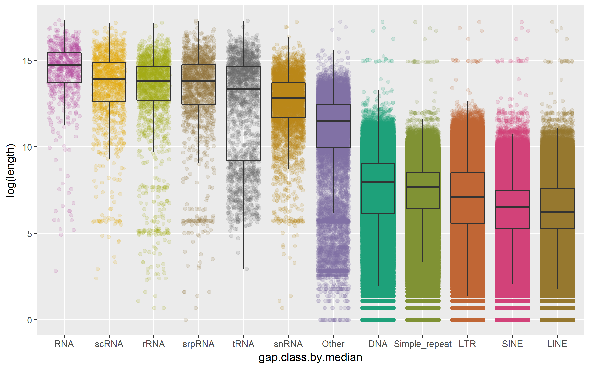<!-- -->


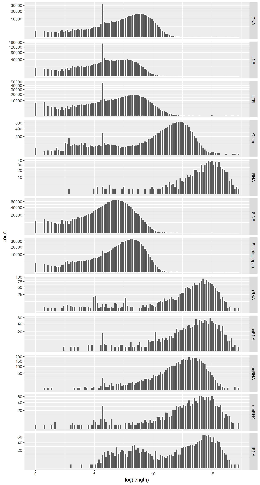<!-- -->
