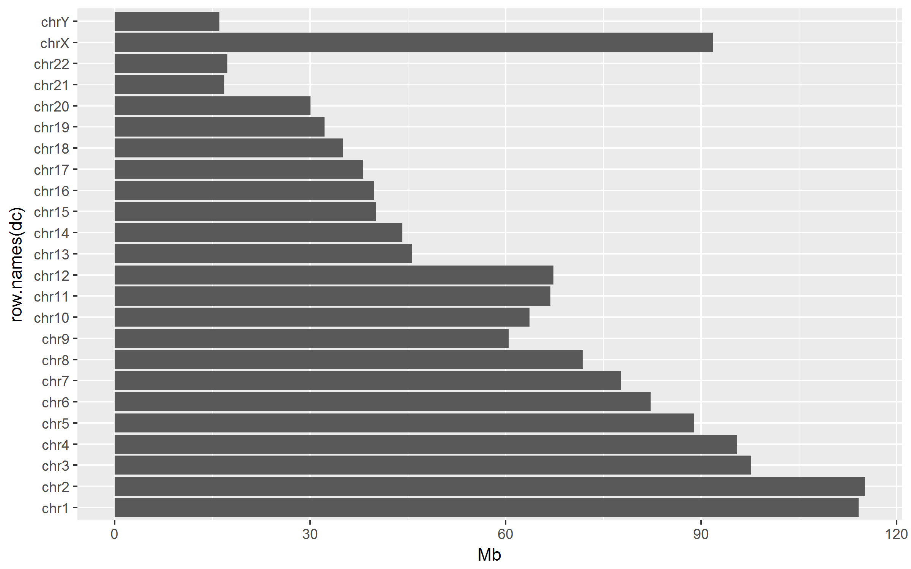

# Repeats in hg19 (RepeatMasker base)
Ronica K  


###Loading/cleaning


UCSC RepeatMasker package


```
## snapshotDate(): 2016-10-11
```

```
## AnnotationHub with 1 record
## # snapshotDate(): 2016-10-11 
## # names(): AH5122
## # $dataprovider: UCSC
## # $species: Homo sapiens
## # $rdataclass: GRanges
## # $title: RepeatMasker
## # $description: GRanges object from UCSC track 'RepeatMasker'
## # $taxonomyid: 9606
## # $genome: hg19
## # $sourcetype: UCSC track
## # $sourceurl: rtracklayer://hgdownload.cse.ucsc.edu/goldenpath/hg19/dat...
## # $sourcelastmodifieddate: NA
## # $sourcesize: NA
## # $tags: c("rmsk", "UCSC", "track", "Gene", "Transcript",
## #   "Annotation") 
## # retrieve record with 'object[["AH5122"]]'
```


```
## GRanges object with 5298130 ranges and 2 metadata columns:
##                          seqnames               ranges strand |
##                             <Rle>            <IRanges>  <Rle> |
##         [1]                  chr1 [16777161, 16777470]      + |
##         [2]                  chr1 [25165801, 25166089]      - |
##         [3]                  chr1 [33553607, 33554646]      + |
##         [4]                  chr1 [50330064, 50332153]      + |
##         [5]                  chr1 [58720068, 58720973]      - |
##         ...                   ...                  ...    ... .
##   [5298126] chr21_gl000210_random       [25379, 25875]      + |
##   [5298127] chr21_gl000210_random       [26438, 26596]      - |
##   [5298128] chr21_gl000210_random       [26882, 27022]      - |
##   [5298129] chr21_gl000210_random       [27297, 27447]      + |
##   [5298130] chr21_gl000210_random       [27469, 27682]      + |
##                    name     score
##             <character> <numeric>
##         [1]       AluSp      2147
##         [2]        AluY      2626
##         [3]         L2b       626
##         [4]      L1PA10     12545
##         [5]       L1PA2      8050
##         ...         ...       ...
##   [5298126]      MER74B      1674
##   [5298127]        MIRc       308
##   [5298128]        MIRc       475
##   [5298129]  HAL1-2a_MD       371
##   [5298130]  HAL1-2a_MD       370
##   -------
##   seqinfo: 93 sequences (1 circular) from hg19 genome
```

Subsetting the data to include only chromosomes 1-22, X, Y; setting strands to *


```
## GRanges object with 5232237 ranges and 2 metadata columns:
##             seqnames               ranges strand |        name     score
##                <Rle>            <IRanges>  <Rle> | <character> <numeric>
##         [1]     chr1 [16777161, 16777470]      * |       AluSp      2147
##         [2]     chr1 [25165801, 25166089]      * |        AluY      2626
##         [3]     chr1 [33553607, 33554646]      * |         L2b       626
##         [4]     chr1 [50330064, 50332153]      * |      L1PA10     12545
##         [5]     chr1 [58720068, 58720973]      * |       L1PA2      8050
##         ...      ...                  ...    ... .         ...       ...
##   [5232233]    chr22 [51243195, 51243802]      * |        L1MC      1419
##   [5232234]    chr22 [51243819, 51243924]      * |       LTR60       534
##   [5232235]    chr22 [51244036, 51244339]      * |      AluYb8      2799
##   [5232236]    chr22 [51244340, 51244456]      * |       LTR60       623
##   [5232237]    chr22 [51244457, 51244541]      * |       LTR60       253
##   -------
##   seqinfo: 24 sequences from hg19 genome
```

Number of unique repeat sequences


```
## [1] 1395
```

###Repeat coverage

Coverage distribution


```
##        Y           
##  Min.   :      23  
##  1st Qu.:   14846  
##  Median :  133503  
##  Mean   : 1038024  
##  3rd Qu.:  480942  
##  Max.   :42450549
```


```
## (CTTAG)n 
##       23
```

```
##      L2a 
## 42450549
```

Square root scale, red median, blue mean
<!-- -->

Repeat coverage by chromosome


```
##              Mb
## chr1  114.15388
## chr2  115.08253
## chr3   97.58727
## chr4   95.42763
## chr5   88.89681
## chr6   82.23161
## chr7   77.69616
## chr8   71.78849
## chr9   60.42945
## chr10  63.66385
## chr11  66.83720
## chr12  67.30508
## chr13  45.61571
## chr14  44.15035
## chr15  40.08942
## chr16  39.80813
## chr17  38.14211
## chr18  34.99920
## chr19  32.19516
## chr20  30.05746
## chr21  16.80298
## chr22  17.25418
## chrX   91.78565
## chrY   16.04321
```

<!-- -->


###Maximum Cluster Length 


Distribution

```
##        X            
##  Min.   :       23  
##  1st Qu.:   886902  
##  Median :  1835883  
##  Mean   :  8604113  
##  3rd Qu.:  4735359  
##  Max.   :147850439
```


```
## (CTTAG)n 
##       23
```

```
##     AluSx 
## 147850439
```

Square root scale, red median, blue mean

<!-- -->

###Maximum Cluster Length vs Total Coverage


```
##                 X      Y
## (A)n     82345122 382541
## (AAATG)n  1726855  65985
## (AACTG)n       47    341
## (AAGTG)n     2765   1803
## (AATAG)n   770254  10436
## (AATTG)n   887560   4265
```


<!-- -->

log10 scale

<!-- -->

###Total Genome within Clusters <= 100Kb Covered by Repeats (excluding gaps)

Distribution


```
##        Z          
##  Min.   :      0  
##  1st Qu.:   6738  
##  Median :  55203  
##  Mean   : 111287  
##  3rd Qu.: 151295  
##  Max.   :2152984
```


```
##   (TG)n AT_rich  AluSx1    AluY    L1M5     MIR 
##       0       0       0       0       0       0
```

```
## HERVH-int 
##   2152984
```

Square root scale, red median, blue mean

<!-- -->

Coverage

```
## [1] 155245309
```

###Repeat Sequences

- Simple Repeat SATR1 (http://www.repeatmasker.org/cgi-bin/ViewRepeat?id=SATR1)
- SINE AluYa8 (http://www.repeatmasker.org/cgi-bin/ViewRepeat?id=AluYa8)
- DNA transposon HSMAR1 (http://www.repeatmasker.org/cgi-bin/ViewRepeat?id=HSMAR1)
- LTR retrotransposon MER95 (http://www.repeatmasker.org/cgi-bin/ViewRepeat?id=MER95)
- LINE UCON13 (http://www.repeatmasker.org/cgi-bin/ViewRepeat?id=UCON13)


__Simple Repeat Sequence SATR1__


```
## GRanges object with 523 ranges and 2 metadata columns:
##         seqnames                 ranges strand |        name     score
##            <Rle>              <IRanges>  <Rle> | <character> <numeric>
##     [1]     chr1 [142786366, 142788612]      * |       SATR1      2079
##     [2]     chr1 [142788624, 142789284]      * |       SATR1      1755
##     [3]     chr1 [142789301, 142790215]      * |       SATR1      1729
##     [4]     chr1 [142793138, 142793187]      * |       SATR1      1304
##     [5]     chr1 [142793485, 142795271]      * |       SATR1      1954
##     ...      ...                    ...    ... .         ...       ...
##   [519]    chr22   [36097399, 36099507]      * |       SATR1      2081
##   [520]     chrY   [13283885, 13286152]      * |       SATR1      2106
##   [521]     chrY   [13286164, 13287758]      * |       SATR1      1802
##   [522]     chrY   [13290682, 13290732]      * |       SATR1      1529
##   [523]     chrY   [13291032, 13292731]      * |       SATR1      2164
##   -------
##   seqinfo: 24 sequences from hg19 genome
```

```
## [1] 899022
```

- reduced intervals


```
## GRanges object with 100 ranges and 0 metadata columns:
##         seqnames                 ranges strand
##            <Rle>              <IRanges>  <Rle>
##     [1]     chr1 [142786366, 143347330]      *
##     [2]     chr1 [147767119, 147767819]      *
##     [3]     chr1 [191796181, 191797220]      *
##     [4]     chr1 [224735210, 224735284]      *
##     [5]     chr1 [248073417, 248075234]      *
##     ...      ...                    ...    ...
##    [96]    chr21   [ 9729373,  9887954]      *
##    [97]    chr21   [33985905, 33994468]      *
##    [98]    chr21   [44370906, 44375518]      *
##    [99]    chr22   [36087349, 36099507]      *
##   [100]     chrY   [13283885, 13292731]      *
##   -------
##   seqinfo: 24 sequences from hg19 genome
```

```
##   [1] 1151977  975139  846171  818386  802914  797074  729997  708778
##   [9]  653852  629877  560965  543615  384472  328866  301616  280398
##  [17]  270413  264329  241545  215721  158582   66964   53465   49128
##  [25]   42415   38988   38656   38375   34836   34028   33605   30538
##  [33]   30371   28139   25610   25222   25129   22472   21577   20797
##  [41]   18553   15650   15109   15061   15024   15022   12506   12159
##  [49]   10711   10710   10361    9236    9016    8965    8949    8847
##  [57]    8564    8457    8414    7984    7395    7208    5942    5417
##  [65]    5316    5060    4919    4917    4844    4732    4613    4231
##  [73]    4211    4194    3881    3831    3675    3320    3010    2894
##  [81]    2813    2690    1835    1818    1141    1040    1040     803
##  [89]     701     440     381     293     276     276     153      98
##  [97]      81      77      75      30
```

```
## [1] 12663971
```

- reduced intervals shorter than or equal to 100Kb


```
## GRanges object with 79 ranges and 0 metadata columns:
##        seqnames                 ranges strand
##           <Rle>              <IRanges>  <Rle>
##    [1]     chr1 [147767119, 147767819]      *
##    [2]     chr1 [191796181, 191797220]      *
##    [3]     chr1 [224735210, 224735284]      *
##    [4]     chr1 [248073417, 248075234]      *
##    [5]     chr2 [ 71246349,  71279953]      *
##    ...      ...                    ...    ...
##   [75]    chr19   [41965007, 42031970]      *
##   [76]    chr21   [33985905, 33994468]      *
##   [77]    chr21   [44370906, 44375518]      *
##   [78]    chr22   [36087349, 36099507]      *
##   [79]     chrY   [13283885, 13292731]      *
##   -------
##   seqinfo: 24 sequences from hg19 genome
```

```
##  [1] 66964 53465 49128 42415 38988 38656 38375 34836 34028 33605 30538
## [12] 30371 28139 25610 25222 25129 22472 21577 20797 18553 15650 15109
## [23] 15061 15024 15022 12506 12159 10711 10710 10361  9236  9016  8965
## [34]  8949  8847  8564  8457  8414  7984  7395  7208  5942  5417  5316
## [45]  5060  4919  4917  4844  4732  4613  4231  4211  4194  3881  3831
## [56]  3675  3320  3010  2894  2813  2690  1835  1818  1141  1040  1040
## [67]   803   701   440   381   293   276   276   153    98    81    77
## [78]    75    30
```

```
## [1] 999284
```

- initial intervals located within reduced intervals


```
## GRanges object with 316 ranges and 2 metadata columns:
##         seqnames                 ranges strand |        name     score
##            <Rle>              <IRanges>  <Rle> | <character> <numeric>
##     [1]     chr1 [147767119, 147767819]      * |       SATR1      1419
##     [2]     chr1 [191796181, 191797220]      * |       SATR1      1645
##     [3]     chr1 [224735210, 224735284]      * |       SATR1       243
##     [4]     chr1 [248073417, 248075234]      * |       SATR1      1918
##     [5]     chr2 [ 71246349,  71247179]      * |       SATR1      1239
##     ...      ...                    ...    ... .         ...       ...
##   [312]    chr22   [36097399, 36099507]      * |       SATR1      2081
##   [313]     chrY   [13283885, 13286152]      * |       SATR1      2106
##   [314]     chrY   [13286164, 13287758]      * |       SATR1      1802
##   [315]     chrY   [13290682, 13290732]      * |       SATR1      1529
##   [316]     chrY   [13291032, 13292731]      * |       SATR1      2164
##   -------
##   seqinfo: 24 sequences from hg19 genome
```

```
## [1] 592479
```

- ratio to initial coverage

```
## [1] 0.6590261
```

__SINE Sequence AluYa8__ 


```
## GRanges object with 334 ranges and 2 metadata columns:
##         seqnames               ranges strand |        name     score
##            <Rle>            <IRanges>  <Rle> | <character> <numeric>
##     [1]     chr1 [ 6399800,  6399950]      * |      AluYa8      1293
##     [2]     chr1 [ 9834115,  9834172]      * |      AluYa8       324
##     [3]     chr1 [23546330, 23546639]      * |      AluYa8      2734
##     [4]     chr1 [26830919, 26831048]      * |      AluYa8      1067
##     [5]     chr1 [45178694, 45178756]      * |      AluYa8       506
##     ...      ...                  ...    ... .         ...       ...
##   [330]     chrY [13450193, 13450256]      * |      AluYa8       420
##   [331]     chrY [17203322, 17203630]      * |      AluYa8      2910
##   [332]     chrY [18958975, 18959241]      * |      AluYa8      2567
##   [333]     chrY [23081701, 23081796]      * |      AluYa8       530
##   [334]     chrY [24390395, 24390517]      * |      AluYa8       913
##   -------
##   seqinfo: 24 sequences from hg19 genome
```

```
## [1] 42675
```

- reduced intervals


```
## GRanges object with 280 ranges and 0 metadata columns:
##         seqnames               ranges strand
##            <Rle>            <IRanges>  <Rle>
##     [1]     chr1 [ 6399800,  6399950]      *
##     [2]     chr1 [ 9834115,  9834172]      *
##     [3]     chr1 [23546330, 23546639]      *
##     [4]     chr1 [26830919, 26831048]      *
##     [5]     chr1 [45178694, 45583785]      *
##     ...      ...                  ...    ...
##   [276]     chrY [13141845, 13450256]      *
##   [277]     chrY [17203322, 17203630]      *
##   [278]     chrY [18958975, 18959241]      *
##   [279]     chrY [23081701, 23081796]      *
##   [280]     chrY [24390395, 24390517]      *
##   -------
##   seqinfo: 24 sequences from hg19 genome
```

```
##   [1] 1567029  992175  943692  929175  883113  871232  805875  705990
##   [9]  705428  703208  692183  650783  645949  536257  526826  513483
##  [17]  430266  428100  425258  412251  405092  384098  344615  332500
##  [25]  312458  308412  304533  304108  291945  253109  210768  206912
##  [33]  204676  181276   90043   65922   42554    1212    1079     376
##  [41]     351     316     312     310     310     310     310     310
##  [49]     310     310     309     309     309     309     308     307
##  [57]     306     305     304     302     302     302     302     301
##  [65]     301     300     300     300     299     298     294     284
##  [73]     283     282     280     267     208     155     151     150
##  [81]     144     144     143     142     141     141     140     139
##  [89]     139     139     138     138     137     137     137     137
##  [97]     137     136     135     135     135     134     134     134
## [105]     134     134     134     133     132     132     132     132
## [113]     132     131     131     130     130     130     130     128
## [121]     128     126     126     124     124     123     123     123
## [129]     123     122     121     121     121     120     120     118
## [137]     118     118     116     116     115     115     114     113
## [145]     113     112     110     109     109     108     107     106
## [153]     106     105     104     104     104     103     103     103
## [161]     103     103     102     100      99      99      99      99
## [169]      99      97      97      97      96      96      96      96
## [177]      96      95      95      95      95      94      93      93
## [185]      93      93      92      91      90      90      90      90
## [193]      89      89      89      89      88      88      88      87
## [201]      87      87      86      86      86      86      85      85
## [209]      85      84      84      83      82      82      81      81
## [217]      81      81      80      80      80      79      79      79
## [225]      79      78      78      77      77      76      76      76
## [233]      76      76      75      74      74      74      73      73
## [241]      73      73      73      72      71      71      70      69
## [249]      69      69      69      68      67      67      67      66
## [257]      66      66      64      63      63      63      62      62
## [265]      62      60      60      59      58      58      58      57
## [273]      57      56      55      54      50      49      46      42
```

```
## [1] 18645027
```

- reduced intervals shorter than or equal to 100Kb


```
## GRanges object with 246 ranges and 0 metadata columns:
##         seqnames               ranges strand
##            <Rle>            <IRanges>  <Rle>
##     [1]     chr1 [ 6399800,  6399950]      *
##     [2]     chr1 [ 9834115,  9834172]      *
##     [3]     chr1 [23546330, 23546639]      *
##     [4]     chr1 [26830919, 26831048]      *
##     [5]     chr1 [74857642, 74857778]      *
##     ...      ...                  ...    ...
##   [242]     chrY [ 8666724,  8666819]      *
##   [243]     chrY [17203322, 17203630]      *
##   [244]     chrY [18958975, 18959241]      *
##   [245]     chrY [23081701, 23081796]      *
##   [246]     chrY [24390395, 24390517]      *
##   -------
##   seqinfo: 24 sequences from hg19 genome
```

```
##   [1] 90043 65922 42554  1212  1079   376   351   316   312   310   310
##  [12]   310   310   310   310   310   309   309   309   309   308   307
##  [23]   306   305   304   302   302   302   302   301   301   300   300
##  [34]   300   299   298   294   284   283   282   280   267   208   155
##  [45]   151   150   144   144   143   142   141   141   140   139   139
##  [56]   139   138   138   137   137   137   137   137   136   135   135
##  [67]   135   134   134   134   134   134   134   133   132   132   132
##  [78]   132   132   131   131   130   130   130   130   128   128   126
##  [89]   126   124   124   123   123   123   123   122   121   121   121
## [100]   120   120   118   118   118   116   116   115   115   114   113
## [111]   113   112   110   109   109   108   107   106   106   105   104
## [122]   104   104   103   103   103   103   103   102   100    99    99
## [133]    99    99    99    97    97    97    96    96    96    96    96
## [144]    95    95    95    95    94    93    93    93    93    92    91
## [155]    90    90    90    90    89    89    89    89    88    88    88
## [166]    87    87    87    86    86    86    86    85    85    85    84
## [177]    84    83    82    82    81    81    81    81    80    80    80
## [188]    79    79    79    79    78    78    77    77    76    76    76
## [199]    76    76    75    74    74    74    73    73    73    73    73
## [210]    72    71    71    70    69    69    69    69    68    67    67
## [221]    67    66    66    66    64    63    63    63    62    62    62
## [232]    60    60    59    58    58    58    57    57    56    55    54
## [243]    50    49    46    42
```

```
## [1] 232252
```

- initial intervals located within reduced intervals


```
## GRanges object with 256 ranges and 2 metadata columns:
##         seqnames               ranges strand |        name     score
##            <Rle>            <IRanges>  <Rle> | <character> <numeric>
##     [1]     chr1 [ 6399800,  6399950]      * |      AluYa8      1293
##     [2]     chr1 [ 9834115,  9834172]      * |      AluYa8       324
##     [3]     chr1 [23546330, 23546639]      * |      AluYa8      2734
##     [4]     chr1 [26830919, 26831048]      * |      AluYa8      1067
##     [5]     chr1 [74857642, 74857778]      * |      AluYa8      1283
##     ...      ...                  ...    ... .         ...       ...
##   [252]     chrY [ 8666724,  8666819]      * |      AluYa8       912
##   [253]     chrY [17203322, 17203630]      * |      AluYa8      2910
##   [254]     chrY [18958975, 18959241]      * |      AluYa8      2567
##   [255]     chrY [23081701, 23081796]      * |      AluYa8       530
##   [256]     chrY [24390395, 24390517]      * |      AluYa8       913
##   -------
##   seqinfo: 24 sequences from hg19 genome
```

```
## [1] 32958
```

- ratio to initial coverage

```
## [1] 0.7723023
```

__DNA Transposon Sequence HSMAR1__


```
## GRanges object with 733 ranges and 2 metadata columns:
##         seqnames                 ranges strand |        name     score
##            <Rle>              <IRanges>  <Rle> | <character> <numeric>
##     [1]     chr1   [11967791, 11967833]      * |      HSMAR1       261
##     [2]     chr1   [13969357, 13970008]      * |      HSMAR1      9596
##     [3]     chr1   [13970313, 13970973]      * |      HSMAR1      9596
##     [4]     chr1   [27499664, 27500000]      * |      HSMAR1      2526
##     [5]     chr1   [27500003, 27500852]      * |      HSMAR1      6469
##     ...      ...                    ...    ... .         ...       ...
##   [729]     chrX [141404218, 141404251]      * |      HSMAR1       239
##   [730]     chrX [144143187, 144144019]      * |      HSMAR1      5852
##   [731]     chrY [  5618498,   5619768]      * |      HSMAR1      8994
##   [732]     chrY [  7332361,   7332390]      * |      HSMAR1       231
##   [733]     chrY [ 22727653,  22728929]      * |      HSMAR1      6412
##   -------
##   seqinfo: 24 sequences from hg19 genome
```

```
## [1] 467506
```

- reduced intervals


```
## GRanges object with 448 ranges and 0 metadata columns:
##         seqnames                 ranges strand
##            <Rle>              <IRanges>  <Rle>
##     [1]     chr1   [11967791, 11967833]      *
##     [2]     chr1   [13969357, 13970973]      *
##     [3]     chr1   [27499664, 27500852]      *
##     [4]     chr1   [40745007, 40746603]      *
##     [5]     chr1   [41768537, 41769791]      *
##     ...      ...                    ...    ...
##   [444]     chrX [141404218, 141404251]      *
##   [445]     chrX [144143187, 144144019]      *
##   [446]     chrY [  5618498,   5619768]      *
##   [447]     chrY [  7332361,   7332390]      *
##   [448]     chrY [ 22727653,  22728929]      *
##   -------
##   seqinfo: 24 sequences from hg19 genome
```

```
##   [1] 1202636 1171634 1136152 1091112 1024566  984293  930015  928921
##   [9]  920535  913675  908384  898266  892817  874132  854996  850780
##  [17]  836395  830009  773594  741909  724416  721292  692132  686576
##  [25]  671709  667680  664065  657181  653713  642223  629427  623551
##  [33]  618884  605930  596816  583963  580184  568111  566799  552086
##  [41]  527480  511476  510865  509262  508007  444670  414515  395573
##  [49]  391070  374020  346687  344975  318403  306705  301453  278678
##  [57]  273218  271555  255005  253969  231202  223829  221911  210633
##  [65]  148666  147962  138334  112119  111329  104093   90082   86364
##  [73]   79775   76059   70186   63508   58700   58303   53897   11586
##  [81]    9339    7635    7405    4175    3598    2832    2327    2297
##  [89]    2279    2248    2226    2209    2209    2155    2129    2061
##  [97]    1965    1932    1923    1873    1857    1842    1811    1738
## [105]    1674    1648    1637    1620    1617    1617    1614    1614
## [113]    1608    1606    1603    1603    1602    1599    1597    1597
## [121]    1595    1595    1589    1589    1588    1587    1587    1587
## [129]    1585    1584    1584    1579    1576    1576    1575    1574
## [137]    1573    1573    1573    1572    1572    1572    1568    1567
## [145]    1565    1565    1565    1561    1560    1557    1555    1554
## [153]    1548    1545    1533    1522    1521    1494    1482    1476
## [161]    1460    1451    1445    1430    1328    1326    1321    1309
## [169]    1306    1303    1300    1298    1296    1296    1294    1292
## [177]    1291    1291    1291    1290    1288    1288    1287    1287
## [185]    1287    1286    1285    1285    1284    1284    1283    1282
## [193]    1282    1282    1282    1281    1280    1279    1279    1278
## [201]    1278    1278    1278    1277    1277    1277    1277    1277
## [209]    1277    1277    1276    1276    1276    1276    1276    1276
## [217]    1275    1274    1274    1274    1274    1274    1273    1272
## [225]    1272    1272    1272    1271    1271    1270    1270    1270
## [233]    1270    1270    1270    1269    1269    1269    1269    1268
## [241]    1268    1268    1268    1267    1267    1267    1267    1266
## [249]    1266    1266    1266    1265    1265    1264    1264    1263
## [257]    1263    1263    1263    1262    1261    1260    1259    1259
## [265]    1258    1258    1257    1257    1257    1257    1257    1257
## [273]    1255    1255    1255    1255    1253    1252    1251    1251
## [281]    1251    1250    1248    1247    1241    1241    1239    1233
## [289]    1232    1230    1228    1227    1226    1225    1224    1218
## [297]    1210    1209    1206    1201    1198    1198    1196    1195
## [305]    1192    1189    1170    1162    1134    1107    1101    1092
## [313]    1071    1065    1063    1059    1027     980     960     957
## [321]     949     946     944     833     789     738     704     655
## [329]     652     638     628     623     606     601     575     553
## [337]     525     509     421     410     407     407     366     364
## [345]     354     327     244     213     207     190     165     145
## [353]     126     104      98      93      93      91      89      78
## [361]      78      77      67      65      64      63      61      60
## [369]      60      58      58      58      58      57      55      55
## [377]      54      54      52      51      51      51      51      51
## [385]      50      50      49      49      49      48      47      47
## [393]      46      46      45      45      43      43      42      41
## [401]      41      41      40      39      39      39      39      38
## [409]      38      37      37      36      36      36      35      35
## [417]      35      35      35      35      35      35      34      34
## [425]      34      34      34      34      34      34      34      34
## [433]      34      34      34      34      34      34      34      33
## [441]      33      30      30      28      25      18      14      12
```

```
## [1] 41689715
```

- reduced intervals shorter than or equal to 100Kb


```
## GRanges object with 378 ranges and 0 metadata columns:
##         seqnames                 ranges strand
##            <Rle>              <IRanges>  <Rle>
##     [1]     chr1   [11967791, 11967833]      *
##     [2]     chr1   [13969357, 13970973]      *
##     [3]     chr1   [27499664, 27500852]      *
##     [4]     chr1   [40745007, 40746603]      *
##     [5]     chr1   [41768537, 41769791]      *
##     ...      ...                    ...    ...
##   [374]     chrX [141404218, 141404251]      *
##   [375]     chrX [144143187, 144144019]      *
##   [376]     chrY [  5618498,   5619768]      *
##   [377]     chrY [  7332361,   7332390]      *
##   [378]     chrY [ 22727653,  22728929]      *
##   -------
##   seqinfo: 24 sequences from hg19 genome
```

```
##   [1] 90082 86364 79775 76059 70186 63508 58700 58303 53897 11586  9339
##  [12]  7635  7405  4175  3598  2832  2327  2297  2279  2248  2226  2209
##  [23]  2209  2155  2129  2061  1965  1932  1923  1873  1857  1842  1811
##  [34]  1738  1674  1648  1637  1620  1617  1617  1614  1614  1608  1606
##  [45]  1603  1603  1602  1599  1597  1597  1595  1595  1589  1589  1588
##  [56]  1587  1587  1587  1585  1584  1584  1579  1576  1576  1575  1574
##  [67]  1573  1573  1573  1572  1572  1572  1568  1567  1565  1565  1565
##  [78]  1561  1560  1557  1555  1554  1548  1545  1533  1522  1521  1494
##  [89]  1482  1476  1460  1451  1445  1430  1328  1326  1321  1309  1306
## [100]  1303  1300  1298  1296  1296  1294  1292  1291  1291  1291  1290
## [111]  1288  1288  1287  1287  1287  1286  1285  1285  1284  1284  1283
## [122]  1282  1282  1282  1282  1281  1280  1279  1279  1278  1278  1278
## [133]  1278  1277  1277  1277  1277  1277  1277  1277  1276  1276  1276
## [144]  1276  1276  1276  1275  1274  1274  1274  1274  1274  1273  1272
## [155]  1272  1272  1272  1271  1271  1270  1270  1270  1270  1270  1270
## [166]  1269  1269  1269  1269  1268  1268  1268  1268  1267  1267  1267
## [177]  1267  1266  1266  1266  1266  1265  1265  1264  1264  1263  1263
## [188]  1263  1263  1262  1261  1260  1259  1259  1258  1258  1257  1257
## [199]  1257  1257  1257  1257  1255  1255  1255  1255  1253  1252  1251
## [210]  1251  1251  1250  1248  1247  1241  1241  1239  1233  1232  1230
## [221]  1228  1227  1226  1225  1224  1218  1210  1209  1206  1201  1198
## [232]  1198  1196  1195  1192  1189  1170  1162  1134  1107  1101  1092
## [243]  1071  1065  1063  1059  1027   980   960   957   949   946   944
## [254]   833   789   738   704   655   652   638   628   623   606   601
## [265]   575   553   525   509   421   410   407   407   366   364   354
## [276]   327   244   213   207   190   165   145   126   104    98    93
## [287]    93    91    89    78    78    77    67    65    64    63    61
## [298]    60    60    58    58    58    58    57    55    55    54    54
## [309]    52    51    51    51    51    51    50    50    49    49    49
## [320]    48    47    47    46    46    45    45    43    43    42    41
## [331]    41    41    40    39    39    39    39    38    38    37    37
## [342]    36    36    36    35    35    35    35    35    35    35    35
## [353]    34    34    34    34    34    34    34    34    34    34    34
## [364]    34    34    34    34    34    34    33    33    30    30    28
## [375]    25    18    14    12
```

```
## [1] 1030492
```

- initial intervals located within reduced intervals


```
## GRanges object with 526 ranges and 2 metadata columns:
##         seqnames                 ranges strand |        name     score
##            <Rle>              <IRanges>  <Rle> | <character> <numeric>
##     [1]     chr1   [11967791, 11967833]      * |      HSMAR1       261
##     [2]     chr1   [13969357, 13970008]      * |      HSMAR1      9596
##     [3]     chr1   [13970313, 13970973]      * |      HSMAR1      9596
##     [4]     chr1   [27499664, 27500000]      * |      HSMAR1      2526
##     [5]     chr1   [27500003, 27500852]      * |      HSMAR1      6469
##     ...      ...                    ...    ... .         ...       ...
##   [522]     chrX [141404218, 141404251]      * |      HSMAR1       239
##   [523]     chrX [144143187, 144144019]      * |      HSMAR1      5852
##   [524]     chrY [  5618498,   5619768]      * |      HSMAR1      8994
##   [525]     chrY [  7332361,   7332390]      * |      HSMAR1       231
##   [526]     chrY [ 22727653,  22728929]      * |      HSMAR1      6412
##   -------
##   seqinfo: 24 sequences from hg19 genome
```

```
## [1] 334342
```

- ratio to initial coverage

```
## [1] 0.7151609
```

__LTR Retrotransposon Sequence MER95__


```
## GRanges object with 156 ranges and 2 metadata columns:
##         seqnames                 ranges strand |        name     score
##            <Rle>              <IRanges>  <Rle> | <character> <numeric>
##     [1]     chr1   [60072011, 60072301]      * |       MER95      1427
##     [2]     chr1   [60072286, 60072462]      * |       MER95       825
##     [3]     chr1   [64055868, 64056247]      * |       MER95      1925
##     [4]     chr1   [64056387, 64056500]      * |       MER95       628
##     [5]     chr1   [89618476, 89618873]      * |       MER95      1728
##     ...      ...                    ...    ... .         ...       ...
##   [152]     chrX [119305444, 119305856]      * |       MER95      2590
##   [153]     chrX [126690498, 126690668]      * |       MER95       690
##   [154]     chrX [126692389, 126692593]      * |       MER95       844
##   [155]     chrX [129488942, 129489326]      * |       MER95      1874
##   [156]     chrY [  3131736,   3131931]      * |       MER95       584
##   -------
##   seqinfo: 24 sequences from hg19 genome
```

```
## [1] 41251
```

- reduced intervals


```
## GRanges object with 113 ranges and 0 metadata columns:
##         seqnames                 ranges strand
##            <Rle>              <IRanges>  <Rle>
##     [1]     chr1 [ 60072011,  60072462]      *
##     [2]     chr1 [ 64055868,  64056500]      *
##     [3]     chr1 [ 89618476,  89618873]      *
##     [4]     chr1 [100721838, 100722679]      *
##     [5]     chr1 [103093541, 103093956]      *
##     ...      ...                    ...    ...
##   [109]     chrX [112969048, 112969471]      *
##   [110]     chrX [119198317, 119305856]      *
##   [111]     chrX [126690498, 126692593]      *
##   [112]     chrX [129488942, 129489326]      *
##   [113]     chrY [  3131736,   3131931]      *
##   -------
##   seqinfo: 24 sequences from hg19 genome
```

```
##   [1] 1766794  162624  125742  113042  107540   22860   18200    2096
##   [9]    1141     992     881     842     755     735     733     730
##  [17]     730     729     725     720     710     706     694     678
##  [25]     674     633     596     512     473     452     437     435
##  [33]     429     428     427     426     424     424     423     420
##  [41]     419     418     418     417     416     416     416     415
##  [49]     415     414     413     411     410     409     407     406
##  [57]     406     405     403     403     402     401     401     400
##  [65]     400     398     398     396     395     395     393     393
##  [73]     390     389     385     385     383     381     379     379
##  [81]     375     359     358     355     345     319     305     284
##  [89]     273     247     234     224     196     196     188     186
##  [97]     185     185     183     178     175     171     143     142
## [105]     119     118     113     111     110     102     101      88
## [113]      84
```

```
## [1] 2361844
```

- reduced intervals shorter than or equal to 100Kb


```
## GRanges object with 108 ranges and 0 metadata columns:
##         seqnames                 ranges strand
##            <Rle>              <IRanges>  <Rle>
##     [1]     chr1 [ 60072011,  60072462]      *
##     [2]     chr1 [ 64055868,  64056500]      *
##     [3]     chr1 [ 89618476,  89618873]      *
##     [4]     chr1 [100721838, 100722679]      *
##     [5]     chr1 [103093541, 103093956]      *
##     ...      ...                    ...    ...
##   [104]     chrX [ 88862563,  88862758]      *
##   [105]     chrX [112969048, 112969471]      *
##   [106]     chrX [126690498, 126692593]      *
##   [107]     chrX [129488942, 129489326]      *
##   [108]     chrY [  3131736,   3131931]      *
##   -------
##   seqinfo: 24 sequences from hg19 genome
```

```
##   [1] 22860 18200  2096  1141   992   881   842   755   735   733   730
##  [12]   730   729   725   720   710   706   694   678   674   633   596
##  [23]   512   473   452   437   435   429   428   427   426   424   424
##  [34]   423   420   419   418   418   417   416   416   416   415   415
##  [45]   414   413   411   410   409   407   406   406   405   403   403
##  [56]   402   401   401   400   400   398   398   396   395   395   393
##  [67]   393   390   389   385   385   383   381   379   379   375   359
##  [78]   358   355   345   319   305   284   273   247   234   224   196
##  [89]   196   188   186   185   185   183   178   175   171   143   142
## [100]   119   118   113   111   110   102   101    88    84
```

```
## [1] 86102
```

- initial intervals located within reduced intervals


```
## GRanges object with 141 ranges and 2 metadata columns:
##         seqnames                 ranges strand |        name     score
##            <Rle>              <IRanges>  <Rle> | <character> <numeric>
##     [1]     chr1   [60072011, 60072301]      * |       MER95      1427
##     [2]     chr1   [60072286, 60072462]      * |       MER95       825
##     [3]     chr1   [64055868, 64056247]      * |       MER95      1925
##     [4]     chr1   [64056387, 64056500]      * |       MER95       628
##     [5]     chr1   [89618476, 89618873]      * |       MER95      1728
##     ...      ...                    ...    ... .         ...       ...
##   [137]     chrX [112969048, 112969471]      * |       MER95      2443
##   [138]     chrX [126690498, 126690668]      * |       MER95       690
##   [139]     chrX [126692389, 126692593]      * |       MER95       844
##   [140]     chrX [129488942, 129489326]      * |       MER95      1874
##   [141]     chrY [  3131736,   3131931]      * |       MER95       584
##   -------
##   seqinfo: 24 sequences from hg19 genome
```

```
## [1] 37846
```

- ratio to initial coverage

```
## [1] 0.9174565
```

__LINE Sequence UCON13__


```
## GRanges object with 51 ranges and 2 metadata columns:
##        seqnames                 ranges strand |        name     score
##           <Rle>              <IRanges>  <Rle> | <character> <numeric>
##    [1]     chr1 [ 74361785,  74362097]      * |      UCON13      1323
##    [2]     chr1 [178901458, 178901602]      * |      UCON13       370
##    [3]     chr2 [105177282, 105177461]      * |      UCON13       307
##    [4]     chr2 [145729262, 145729661]      * |      UCON13      1826
##    [5]     chr2 [196331048, 196331295]      * |      UCON13       573
##    ...      ...                    ...    ... .         ...       ...
##   [47]    chr20 [ 21384361,  21384524]      * |      UCON13       537
##   [48]    chr20 [ 21451001,  21451273]      * |      UCON13       753
##   [49]    chr20 [ 36344120,  36344322]      * |      UCON13       881
##   [50]     chrX [ 96793628,  96793880]      * |      UCON13       912
##   [51]     chrX [125681390, 125681676]      * |      UCON13       623
##   -------
##   seqinfo: 24 sequences from hg19 genome
```

```
## [1] 10448
```

- reduced intervals


```
## GRanges object with 49 ranges and 0 metadata columns:
##        seqnames                 ranges strand
##           <Rle>              <IRanges>  <Rle>
##    [1]     chr1 [ 74361785,  74362097]      *
##    [2]     chr1 [178901458, 178901602]      *
##    [3]     chr2 [105177282, 105177461]      *
##    [4]     chr2 [145729262, 145729661]      *
##    [5]     chr2 [196331048, 196331295]      *
##    ...      ...                    ...    ...
##   [45]    chr19 [ 31267559,  31267819]      *
##   [46]    chr20 [ 21384361,  21451273]      *
##   [47]    chr20 [ 36344120,  36344322]      *
##   [48]     chrX [ 96793628,  96793880]      *
##   [49]     chrX [125681390, 125681676]      *
##   -------
##   seqinfo: 24 sequences from hg19 genome
```

```
##  [1] 110786  66913    400    359    354    334    331    317    313    290
## [11]    287    287    275    261    261    253    252    248    243    240
## [21]    233    230    227    226    221    207    203    201    184    180
## [31]    176    165    163    146    145    142    133    127    126    117
## [41]    105    102    101     96     94     91     79     73     65
```

```
## [1] 187362
```

- reduced intervals shorter than or equal to 100Kb


```
## GRanges object with 48 ranges and 0 metadata columns:
##        seqnames                 ranges strand
##           <Rle>              <IRanges>  <Rle>
##    [1]     chr1 [ 74361785,  74362097]      *
##    [2]     chr1 [178901458, 178901602]      *
##    [3]     chr2 [105177282, 105177461]      *
##    [4]     chr2 [145729262, 145729661]      *
##    [5]     chr2 [196331048, 196331295]      *
##    ...      ...                    ...    ...
##   [44]    chr19 [ 31267559,  31267819]      *
##   [45]    chr20 [ 21384361,  21451273]      *
##   [46]    chr20 [ 36344120,  36344322]      *
##   [47]     chrX [ 96793628,  96793880]      *
##   [48]     chrX [125681390, 125681676]      *
##   -------
##   seqinfo: 24 sequences from hg19 genome
```

```
##  [1] 66913   400   359   354   334   331   317   313   290   287   287
## [12]   275   261   261   253   252   248   243   240   233   230   227
## [23]   226   221   207   203   201   184   180   176   165   163   146
## [34]   145   142   133   127   126   117   105   102   101    96    94
## [45]    91    79    73    65
```

```
## [1] 76576
```

- initial intervals located within reduced intervals


```
## GRanges object with 49 ranges and 2 metadata columns:
##        seqnames                 ranges strand |        name     score
##           <Rle>              <IRanges>  <Rle> | <character> <numeric>
##    [1]     chr1 [ 74361785,  74362097]      * |      UCON13      1323
##    [2]     chr1 [178901458, 178901602]      * |      UCON13       370
##    [3]     chr2 [105177282, 105177461]      * |      UCON13       307
##    [4]     chr2 [145729262, 145729661]      * |      UCON13      1826
##    [5]     chr2 [196331048, 196331295]      * |      UCON13       573
##    ...      ...                    ...    ... .         ...       ...
##   [45]    chr20 [ 21384361,  21384524]      * |      UCON13       537
##   [46]    chr20 [ 21451001,  21451273]      * |      UCON13       753
##   [47]    chr20 [ 36344120,  36344322]      * |      UCON13       881
##   [48]     chrX [ 96793628,  96793880]      * |      UCON13       912
##   [49]     chrX [125681390, 125681676]      * |      UCON13       623
##   -------
##   seqinfo: 24 sequences from hg19 genome
```

```
## [1] 10100
```

- ratio to initial coverage

```
## [1] 0.9666922
```
###Y/Z Ratio


```
##          total.coverage reduced.coverage     ratio
## (A)n             382541              610 0.0015946
## (AAATG)n          65985            21391 0.3241797
## (AACTG)n            341              341 1.0000000
## (AAGTG)n           1803             1803 1.0000000
## (AATAG)n          10436             9307 0.8918168
## (AATTG)n           4265             4077 0.9559203
```

Ratio distribution


```
##    dyz.ratio     
##  Min.   :0.0000  
##  1st Qu.:0.3449  
##  Median :0.6745  
##  Mean   :0.5999  
##  3rd Qu.:0.8628  
##  Max.   :1.0000
```

Red median, blue mean

<!-- -->

###Session Info


```
## R version 3.3.2 (2016-10-31)
## Platform: x86_64-w64-mingw32/x64 (64-bit)
## Running under: Windows 7 x64 (build 7601) Service Pack 1
## 
## locale:
## [1] LC_COLLATE=English_United States.1252 
## [2] LC_CTYPE=English_United States.1252   
## [3] LC_MONETARY=English_United States.1252
## [4] LC_NUMERIC=C                          
## [5] LC_TIME=English_United States.1252    
## 
## attached base packages:
## [1] parallel  stats4    stats     graphics  grDevices utils     datasets 
## [8] methods   base     
## 
## other attached packages:
## [1] ggplot2_2.2.1        AnnotationHub_2.6.4  GenomicRanges_1.26.1
## [4] GenomeInfoDb_1.10.1  IRanges_2.8.1        S4Vectors_0.12.1    
## [7] BiocGenerics_0.20.0 
## 
## loaded via a namespace (and not attached):
##  [1] Rcpp_0.12.8                   BiocInstaller_1.24.0         
##  [3] plyr_1.8.4                    XVector_0.14.0               
##  [5] tools_3.3.2                   zlibbioc_1.20.0              
##  [7] digest_0.6.11                 RSQLite_1.1-1                
##  [9] evaluate_0.10                 memoise_1.0.0                
## [11] tibble_1.2                    gtable_0.2.0                 
## [13] shiny_0.14.2                  DBI_0.5-1                    
## [15] yaml_2.1.14                   httr_1.2.1                   
## [17] stringr_1.1.0                 knitr_1.15.1                 
## [19] rprojroot_1.1                 grid_3.3.2                   
## [21] Biobase_2.34.0                R6_2.2.0                     
## [23] AnnotationDbi_1.36.0          rmarkdown_1.3                
## [25] magrittr_1.5                  backports_1.0.4              
## [27] scales_0.4.1                  htmltools_0.3.5              
## [29] assertthat_0.1                mime_0.5                     
## [31] interactiveDisplayBase_1.12.0 xtable_1.8-2                 
## [33] colorspace_1.3-2              httpuv_1.3.3                 
## [35] labeling_0.3                  stringi_1.1.2                
## [37] lazyeval_0.2.0                munsell_0.4.3
```
