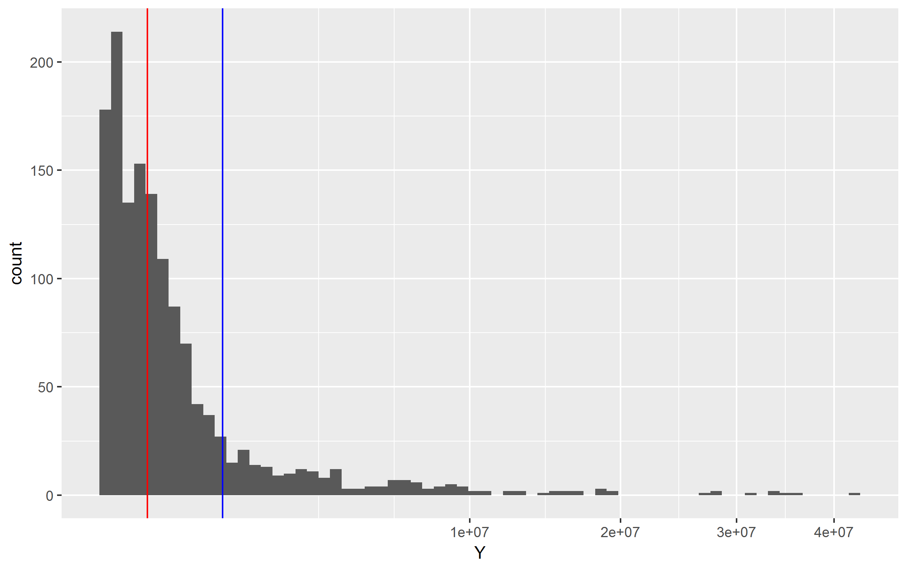

# Repeats in hg19 (RepeatMasker base)
Ronica K  


###Loading/cleaning


UCSC RepeatMasker package


```
## snapshotDate(): 2016-10-11
```

```
## AnnotationHub with 1 record
## # snapshotDate(): 2016-10-11 
## # names(): AH5122
## # $dataprovider: UCSC
## # $species: Homo sapiens
## # $rdataclass: GRanges
## # $title: RepeatMasker
## # $description: GRanges object from UCSC track 'RepeatMasker'
## # $taxonomyid: 9606
## # $genome: hg19
## # $sourcetype: UCSC track
## # $sourceurl: rtracklayer://hgdownload.cse.ucsc.edu/goldenpath/hg19/dat...
## # $sourcelastmodifieddate: NA
## # $sourcesize: NA
## # $tags: c("rmsk", "UCSC", "track", "Gene", "Transcript",
## #   "Annotation") 
## # retrieve record with 'object[["AH5122"]]'
```


```
## GRanges object with 5298130 ranges and 2 metadata columns:
##                          seqnames               ranges strand |
##                             <Rle>            <IRanges>  <Rle> |
##         [1]                  chr1 [16777161, 16777470]      + |
##         [2]                  chr1 [25165801, 25166089]      - |
##         [3]                  chr1 [33553607, 33554646]      + |
##         [4]                  chr1 [50330064, 50332153]      + |
##         [5]                  chr1 [58720068, 58720973]      - |
##         ...                   ...                  ...    ... .
##   [5298126] chr21_gl000210_random       [25379, 25875]      + |
##   [5298127] chr21_gl000210_random       [26438, 26596]      - |
##   [5298128] chr21_gl000210_random       [26882, 27022]      - |
##   [5298129] chr21_gl000210_random       [27297, 27447]      + |
##   [5298130] chr21_gl000210_random       [27469, 27682]      + |
##                    name     score
##             <character> <numeric>
##         [1]       AluSp      2147
##         [2]        AluY      2626
##         [3]         L2b       626
##         [4]      L1PA10     12545
##         [5]       L1PA2      8050
##         ...         ...       ...
##   [5298126]      MER74B      1674
##   [5298127]        MIRc       308
##   [5298128]        MIRc       475
##   [5298129]  HAL1-2a_MD       371
##   [5298130]  HAL1-2a_MD       370
##   -------
##   seqinfo: 93 sequences (1 circular) from hg19 genome
```

Subsetting the data to include only chromosomes 1-22, X, Y


```
## GRanges object with 5232237 ranges and 2 metadata columns:
##             seqnames               ranges strand |        name     score
##                <Rle>            <IRanges>  <Rle> | <character> <numeric>
##         [1]     chr1 [16777161, 16777470]      + |       AluSp      2147
##         [2]     chr1 [25165801, 25166089]      - |        AluY      2626
##         [3]     chr1 [33553607, 33554646]      + |         L2b       626
##         [4]     chr1 [50330064, 50332153]      + |      L1PA10     12545
##         [5]     chr1 [58720068, 58720973]      - |       L1PA2      8050
##         ...      ...                  ...    ... .         ...       ...
##   [5232233]    chr22 [51243195, 51243802]      - |        L1MC      1419
##   [5232234]    chr22 [51243819, 51243924]      + |       LTR60       534
##   [5232235]    chr22 [51244036, 51244339]      + |      AluYb8      2799
##   [5232236]    chr22 [51244340, 51244456]      + |       LTR60       623
##   [5232237]    chr22 [51244457, 51244541]      + |       LTR60       253
##   -------
##   seqinfo: 24 sequences from hg19 genome
```

Number of unique repeat sequences


```
## [1] 1395
```

###Repeat coverage

Coverage distribution


```
##        Y           
##  Min.   :      23  
##  1st Qu.:   14846  
##  Median :  133503  
##  Mean   : 1038024  
##  3rd Qu.:  480942  
##  Max.   :42450549
```

Square root scale, red median, blue mean
<!-- -->

Repeat coverage by chromosome


```
##              Mb
## chr1  114.15388
## chr2  115.08253
## chr3   97.58727
## chr4   95.42763
## chr5   88.89681
## chr6   82.23161
## chr7   77.69616
## chr8   71.78849
## chr9   60.42945
## chr10  63.66385
## chr11  66.83720
## chr12  67.30508
## chr13  45.61571
## chr14  44.15035
## chr15  40.08942
## chr16  39.80813
## chr17  38.14211
## chr18  34.99920
## chr19  32.19516
## chr20  30.05746
## chr21  16.80298
## chr22  17.25418
## chrX   91.78565
## chrY   16.04321
```

<!-- -->

###MADE1 repeat sequence 
http://www.repeatmasker.org/cgi-bin/ViewRepeat?id=MADE1

Across the genome


```
## RleList of length 24
## $chr1
## integer-Rle of length 249250621 with 1033 runs
##   Lengths: 4892438      51   22667      20 ...  340668      80   68620
##   Values :       0       1       0       1 ...       0       1       0
## 
## $chr2
## integer-Rle of length 243199373 with 1317 runs
##   Lengths:  548416      58 1863245      41 ... 1971554      54  238135
##   Values :       0       1       0       1 ...       0       1       0
## 
## $chr3
## integer-Rle of length 198022430 with 1045 runs
##   Lengths: 114250     51 216770     39 ...     54 376839     76 271674
##   Values :      0      1      0      1 ...      1      0      1      0
## 
## $chr4
## integer-Rle of length 191154276 with 1181 runs
##   Lengths:  850824      79 1480360      41 ...   76695      81  260584
##   Values :       0       1       0       1 ...       0       1       0
## 
## $chr5
## integer-Rle of length 180915260 with 1021 runs
##   Lengths:  262904      80   16951      54 ... 1425450      80  568052
##   Values :       0       1       0       1 ...       0       1       0
## 
## ...
## <19 more elements>
```

On chromosome Y


```
## RleList of length 1
## $chrY
## integer-Rle of length 59373566 with 105 runs
##   Lengths:   564821       48   171472 ...  5770774       83 30816273
##   Values :        0        1        0 ...        0        1        0
```

```
##   [1]   564821       48   171472       42   917172       62   306080
##   [8]       41     1370       41   262440       50    80822       40
##  [15]   295429       50      110       49    17773       54      295
##  [22]       34   879889       80   321702       73   174826       37
##  [29]   999406       86   663788       80    84027       78   127966
##  [36]       47   112180       79  1028623       36      294       49
##  [43]   126287       38   200737       51  6060479       46   491627
##  [50]       69    17392       56     8708       76   134852       94
##  [57]   499876       80   100018       38   429310       86   698283
##  [64]       81   290573       80    38485       70    48223       70
##  [71]    97605       80   259736       46   110982       65   759306
##  [78]       49      317       37    48698       50   416329       71
##  [85]    58328       71   138637       65   818618       78   228588
##  [92]       84       22       50   395816       45     4303       52
##  [99]  3109452       85   181275       70  5770774       83 30816273
```

Gaps exceeding N(=10^6)


```
## [1]  1028623  6060479  3109452  5770774 30816273
```

Reduced intervals


```
## RleList of length 24
## $chr1
## integer-Rle of length 249250621 with 115 runs
##   Lengths:  4892438   983576  2046458 ...  1356333  1246315    68620
##   Values :        0        1        0 ...        0        1        0
## 
## $chr2
## integer-Rle of length 243199373 with 107 runs
##   Lengths:   548416       58  1863245 ...  1971554       54   238135
##   Values :        0        1        0 ...        0        1        0
## 
## $chr3
## integer-Rle of length 198022430 with 91 runs
##   Lengths:   114250  4707358  1137524 ...  1199027  8203239   271674
##   Values :        0        1        0 ...        0        1        0
## 
## $chr4
## integer-Rle of length 191154276 with 73 runs
##   Lengths:   850824       79  1480360 ...  1024973  3641661   260584
##   Values :        0        1        0 ...        0        1        0
## 
## $chr5
## integer-Rle of length 180915260 with 69 runs
##   Lengths:   262904  1721187  1735721 ...  1425450       80   568052
##   Values :        0        1        0 ...        0        1        0
## 
## ...
## <19 more elements>
```

```
## RleList of length 1
## $chrY
## integer-Rle of length 59373566 with 11 runs
##   Lengths:   564821  5417818  1028623 ...  5770774       83 30816273
##   Values :        0        1        0 ...        0        1        0
```

```
##  [1]   564821  5417818  1028623   327492  6060479  6096321  3109452
##  [8]   181430  5770774       83 30816273
```

Max MADE1 cluster


```
## [1] 23961674
```

```
## GRanges object with 1 range and 0 metadata columns:
##       seqnames               ranges strand
##          <Rle>            <IRanges>  <Rle>
##   [1]     chrX [12633889, 36595562]      *
##   -------
##   seqinfo: 24 sequences from hg19 genome
```

```
## RleList of length 1
## $chrX
## integer-Rle of length 155270560 with 57 runs
##   Lengths:   614821  8531560  1011920 ...  1730765   603417   463140
##   Values :        0        1        0 ...        0        1        0
```

```
##  [1]   614821  8531560  1011920  1259423  1216164 23961674  1066928
##  [8]  1273347  1165683  2014637  1239435  4553025  1930186  1818651
## [15]  3620281   114721  1195754   726348  4833551       80  1986037
## [22]   831147  2485713   246632  1765365  1602674  2440413  2043232
## [29]  2206270  1601128  1174983  4220498  1431079  9890018  1148696
## [36]  5045016  2806789  2563844  1265409   634956  1339511  3000149
## [43]  2234672 10754216  2465672  7252362  1545272  1746117  2340611
## [50]  6177174  1024314   239724  2815316       40  1730765   603417
## [57]   463140
```

###Maximum Cluster Length 


Distribution

```
##        X            
##  Min.   :       23  
##  1st Qu.:   886902  
##  Median :  1835883  
##  Mean   :  8604113  
##  3rd Qu.:  4735359  
##  Max.   :147850439
```

Square root scale, red median, blue mean

<!-- -->

###Maximum Cluster Length vs Total Coverage


```
##                 X      Y
## (A)n     82345122 382541
## (AAATG)n  1726855  65985
## (AACTG)n       47    341
## (AAGTG)n     2765   1803
## (AATAG)n   770254  10436
## (AATTG)n   887560   4265
```


<!-- -->

log10 scale

<!-- -->

###Session Info


```
## R version 3.3.2 (2016-10-31)
## Platform: x86_64-w64-mingw32/x64 (64-bit)
## Running under: Windows 7 x64 (build 7601) Service Pack 1
## 
## locale:
## [1] LC_COLLATE=English_United States.1252 
## [2] LC_CTYPE=English_United States.1252   
## [3] LC_MONETARY=English_United States.1252
## [4] LC_NUMERIC=C                          
## [5] LC_TIME=English_United States.1252    
## 
## attached base packages:
## [1] parallel  stats4    stats     graphics  grDevices utils     datasets 
## [8] methods   base     
## 
## other attached packages:
## [1] ggplot2_2.2.0        AnnotationHub_2.6.4  GenomicRanges_1.26.1
## [4] GenomeInfoDb_1.10.1  IRanges_2.8.1        S4Vectors_0.12.1    
## [7] BiocGenerics_0.20.0 
## 
## loaded via a namespace (and not attached):
##  [1] Rcpp_0.12.8                   BiocInstaller_1.24.0         
##  [3] plyr_1.8.4                    XVector_0.14.0               
##  [5] tools_3.3.2                   zlibbioc_1.20.0              
##  [7] digest_0.6.10                 RSQLite_1.1-1                
##  [9] evaluate_0.10                 memoise_1.0.0                
## [11] tibble_1.2                    gtable_0.2.0                 
## [13] shiny_0.14.2                  DBI_0.5-1                    
## [15] curl_2.3                      yaml_2.1.14                  
## [17] httr_1.2.1                    stringr_1.1.0                
## [19] knitr_1.15.1                  rprojroot_1.1                
## [21] grid_3.3.2                    Biobase_2.34.0               
## [23] R6_2.2.0                      AnnotationDbi_1.36.0         
## [25] rmarkdown_1.3                 magrittr_1.5                 
## [27] backports_1.0.4               scales_0.4.1                 
## [29] htmltools_0.3.5               assertthat_0.1               
## [31] mime_0.5                      interactiveDisplayBase_1.12.0
## [33] xtable_1.8-2                  colorspace_1.3-2             
## [35] httpuv_1.3.3                  labeling_0.3                 
## [37] stringi_1.1.2                 lazyeval_0.2.0               
## [39] munsell_0.4.3
```
