# Coverage and reduced intervals
Ronica K  


###Coverage and Rle

Some NON-overlapping ranges on chromosome 1 (30 bp length) of some NON-existing creature


```
## GRanges object with 4 ranges and 0 metadata columns:
##       seqnames    ranges strand
##          <Rle> <IRanges>  <Rle>
##   [1]     chr1  [ 6,  8]      +
##   [2]     chr1  [13, 15]      +
##   [3]     chr1  [18, 20]      +
##   [4]     chr1  [24, 26]      +
##   -------
##   seqinfo: 1 sequence from an unspecified genome
```

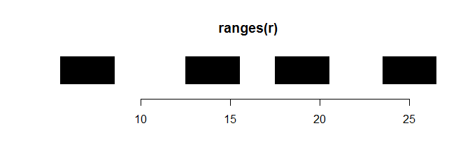<!-- -->

- Coverage 

Lengths - length of a genome segment 

Values - number of ranges that cover the segment


```
## RleList of length 1
## $chr1
## integer-Rle of length 30 with 9 runs
##   Lengths: 5 3 4 3 2 3 3 3 4
##   Values : 0 1 0 1 0 1 0 1 0
```


This one is a direct representation of coverage

Chromosome length on x-axis, number of covering ranges on y-axis

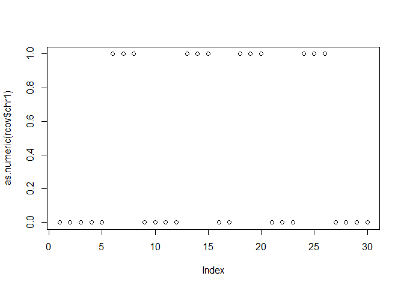<!-- -->

- Add some overlap (ranges 2 and 3)


```
## GRanges object with 4 ranges and 0 metadata columns:
##       seqnames    ranges strand
##          <Rle> <IRanges>  <Rle>
##   [1]     chr1  [ 6,  8]      +
##   [2]     chr1  [13, 18]      +
##   [3]     chr1  [18, 20]      +
##   [4]     chr1  [24, 26]      +
##   -------
##   seqinfo: 1 sequence from an unspecified genome
```

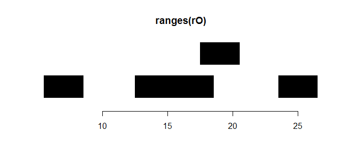<!-- -->

Note the difference in Lengths and Values 


```
## RleList of length 1
## $chr1
## integer-Rle of length 30 with 9 runs
##   Lengths: 5 3 4 5 1 2 3 3 4
##   Values : 0 1 0 1 2 1 0 1 0
```

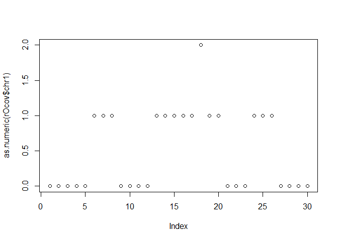<!-- -->


- And some more  


```
## GRanges object with 4 ranges and 0 metadata columns:
##       seqnames    ranges strand
##          <Rle> <IRanges>  <Rle>
##   [1]     chr1  [ 6, 14]      +
##   [2]     chr1  [13, 18]      +
##   [3]     chr1  [18, 25]      +
##   [4]     chr1  [24, 26]      +
##   -------
##   seqinfo: 1 sequence from an unspecified genome
```

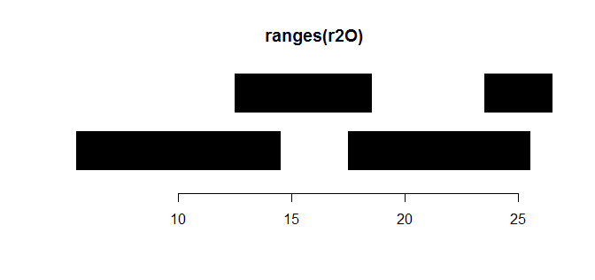<!-- -->


```
## RleList of length 1
## $chr1
## integer-Rle of length 30 with 9 runs
##   Lengths: 5 7 2 3 1 5 2 1 4
##   Values : 0 1 2 1 2 1 2 1 0
```

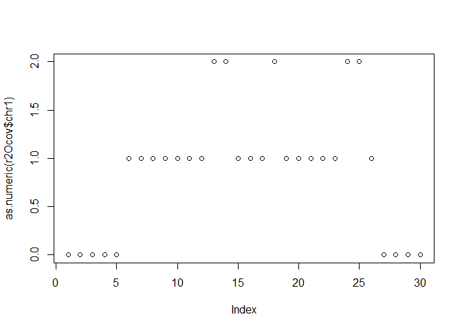<!-- -->


- And even more  


```
## GRanges object with 4 ranges and 0 metadata columns:
##       seqnames    ranges strand
##          <Rle> <IRanges>  <Rle>
##   [1]     chr1  [ 6, 18]      +
##   [2]     chr1  [13, 20]      +
##   [3]     chr1  [18, 25]      +
##   [4]     chr1  [24, 26]      +
##   -------
##   seqinfo: 1 sequence from an unspecified genome
```

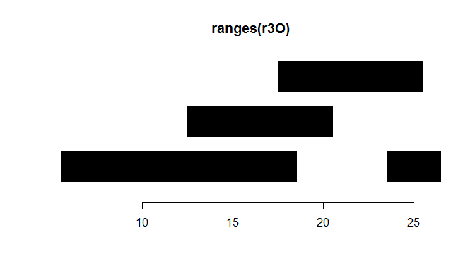<!-- -->


```
## RleList of length 1
## $chr1
## integer-Rle of length 30 with 9 runs
##   Lengths: 5 7 5 1 2 3 2 1 4
##   Values : 0 1 2 3 2 1 2 1 0
```

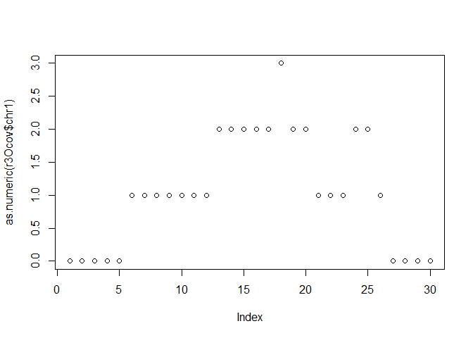<!-- -->


###Reduced ranges

Get back to the first set of ranges with no overlaps

There we have gaps of lengths 2, 3 and 4 bp

```
## GRanges object with 4 ranges and 0 metadata columns:
##       seqnames    ranges strand
##          <Rle> <IRanges>  <Rle>
##   [1]     chr1  [ 6,  8]      +
##   [2]     chr1  [13, 15]      +
##   [3]     chr1  [18, 20]      +
##   [4]     chr1  [24, 26]      +
##   -------
##   seqinfo: 1 sequence from an unspecified genome
```


```
## RleList of length 1
## $chr1
## integer-Rle of length 30 with 9 runs
##   Lengths: 5 3 4 3 2 3 3 3 4
##   Values : 0 1 0 1 0 1 0 1 0
```

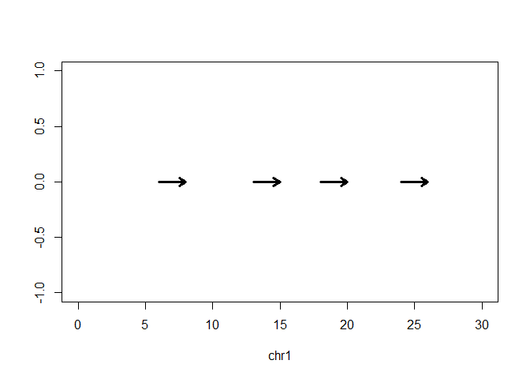<!-- -->

Lets reduce two ranges into one if they are 

- 2 (or less) bp apart


```
## GRanges object with 3 ranges and 0 metadata columns:
##       seqnames    ranges strand
##          <Rle> <IRanges>  <Rle>
##   [1]     chr1  [ 6,  8]      +
##   [2]     chr1  [13, 20]      +
##   [3]     chr1  [24, 26]      +
##   -------
##   seqinfo: 1 sequence from an unspecified genome
```


```
## RleList of length 1
## $chr1
## integer-Rle of length 30 with 7 runs
##   Lengths: 5 3 4 8 3 3 4
##   Values : 0 1 0 1 0 1 0
```

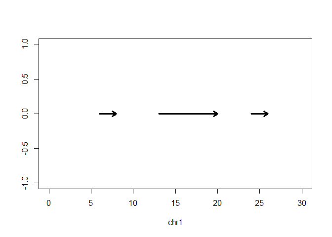<!-- -->

- 3 or less


```
## GRanges object with 2 ranges and 0 metadata columns:
##       seqnames    ranges strand
##          <Rle> <IRanges>  <Rle>
##   [1]     chr1  [ 6,  8]      +
##   [2]     chr1  [13, 26]      +
##   -------
##   seqinfo: 1 sequence from an unspecified genome
```


```
## RleList of length 1
## $chr1
## integer-Rle of length 30 with 5 runs
##   Lengths:  5  3  4 14  4
##   Values :  0  1  0  1  0
```

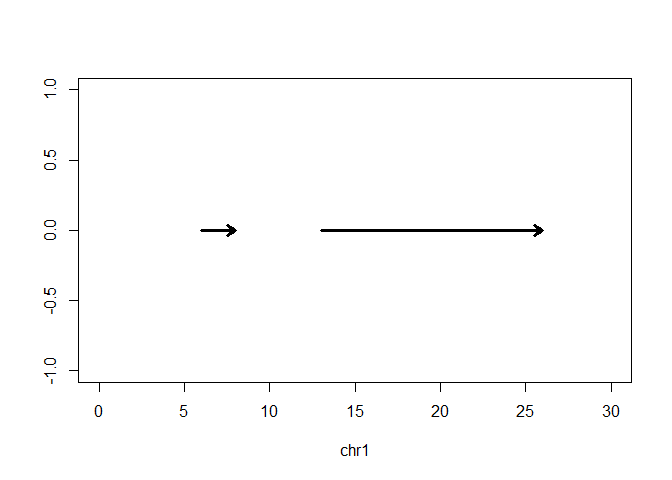<!-- -->

- 4 or less


```
## GRanges object with 1 range and 0 metadata columns:
##       seqnames    ranges strand
##          <Rle> <IRanges>  <Rle>
##   [1]     chr1   [6, 26]      +
##   -------
##   seqinfo: 1 sequence from an unspecified genome
```


```
## RleList of length 1
## $chr1
## integer-Rle of length 30 with 3 runs
##   Lengths:  5 21  4
##   Values :  0  1  0
```

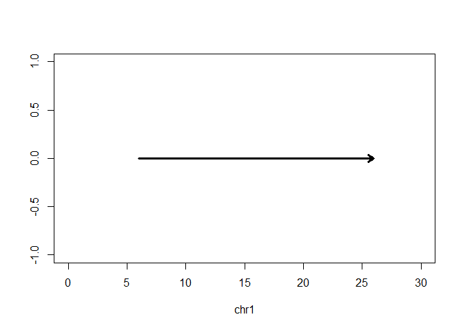<!-- -->
