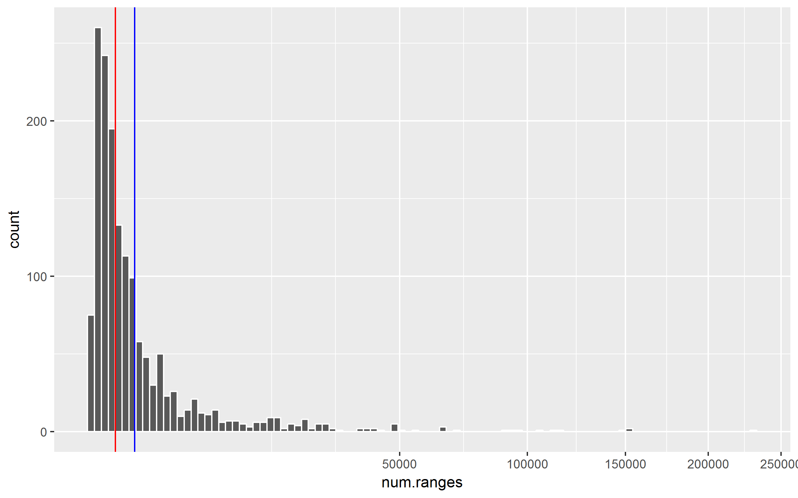

# Mouse vs Human
Ronica K  


###Mouse genome

__UCSC RepeatMasker Track__


```
## GRanges object with 5138231 ranges and 3 metadata columns:
##             seqnames                 ranges strand |        name
##                <Rle>              <IRanges>  <Rle> | <character>
##         [1]     chr1 [ 67108753,  67108881]      + |  RLTR17B_Mm
##         [2]     chr1 [134217652, 134217732]      - |      BC1_Mm
##         [3]     chr1 [  8386826,   8389555]      - |         Lx2
##         [4]     chr1 [ 16776989,  16779051]      + |     L1_Mus1
##         [5]     chr1 [ 33554409,  33554640]      - |          B4
##         ...      ...                    ...    ... .         ...
##   [5138227]    chr19   [61330641, 61330789]      - |      MLT1A0
##   [5138228]    chr19   [61330996, 61331153]      + |      RSINE1
##   [5138229]    chr19   [61331175, 61331210]      + |     AT_rich
##   [5138230]    chr19   [61331244, 61331276]      - |      MT-int
##   [5138231]    chr19   [61331281, 61331566]      + |   (TTAGGG)n
##                     class         family
##               <character>    <character>
##         [1]           LTR           ERVK
##         [2]    RNA_repeat          scRNA
##         [3]          LINE             L1
##         [4]          LINE             L1
##         [5]          SINE             B4
##         ...           ...            ...
##   [5138227]           LTR      ERVL-MaLR
##   [5138228]          SINE             B4
##   [5138229] Simple_repeat Low_complexity
##   [5138230]           LTR      ERVL-MaLR
##   [5138231] Simple_repeat  Simple_repeat
##   -------
##   seqinfo: 21 sequences from mm10 genome
```

__Number of unique repeat sequences__


```
## [1] 1554
```


###Repeats


```
##       chr              length                   class        
##  chr1   : 432854   Min.   :     6.0   DNA          : 456948  
##  chr2   : 414353   1st Qu.:    91.0   LINE         :1480369  
##  chr3   : 348034   Median :   188.0   LTR          : 708210  
##  chr4   : 321696   Mean   :   276.8   Other        :  15422  
##  chr5   : 307874   3rd Qu.:   306.0   RNA_repeat   :  11246  
##  chr6   : 286619   Max.   :160602.0   Simple_repeat: 790203  
##  (Other):3120807                      SINE         :1769839  
##             family         genome       
##  Alu           :1175329   hg19:5232237  
##  L1            : 938484                 
##  MIR           : 590625                 
##  L2            : 462077                 
##  Simple_repeat : 413380                 
##  Low_complexity: 367822                 
##  (Other)       :1284520
```

```
##       chr              length                  class        
##  chr1   : 365923   Min.   :    6.0   DNA          : 162979  
##  chr2   : 347316   1st Qu.:   61.0   LINE         : 987161  
##  chrX   : 312645   Median :  130.0   LTR          : 970384  
##  chr5   : 305982   Mean   :  233.3   Other        :  31745  
##  chr4   : 305744   3rd Qu.:  218.0   RNA_repeat   :  18770  
##  chr3   : 284304   Max.   :38417.0   Simple_repeat:1436539  
##  (Other):3216317                     SINE         :1530653  
##             family         genome       
##  Simple_repeat :1013987   mm10:5138231  
##  L1            : 903043                 
##  Alu           : 573497                 
##  ERVL-MaLR     : 454137                 
##  B4            : 397255                 
##  Low_complexity: 385853                 
##  (Other)       :1410459
```

__Number of repeats by class__


```
##                  hg19    mm10
## DNA            456948  162979
## LINE          1480369  987161
## LTR            708210  970384
## Other           15422   31745
## RNA_repeat      11246   18770
## Simple_repeat  790203 1436539
## SINE          1769839 1530653
```

__Genome covered by class__


```
##                    hg19      mm10
## DNA            98275783  29427898
## LINE          631141049 547282808
## LTR           264167042 318893375
## Other           6109487  11234257
## RNA_repeat      1119566   1539359
## Simple_repeat  55563959  84585973
## SINE          391666614 205824560
```

__Length by species__

<!-- -->


__Length by class__

__in mouse__


```
##            DNA    LINE    LTR  Other RNA_repeat Simple_repeat  SINE
## Min.      11.0    11.0   11.0   11.0      11.00          6.00  11.0
## 1st Qu.  108.0   139.0  129.0  115.0      60.00         30.00  98.0
## Median   160.0   280.0  261.0  200.0      73.00         43.00 135.0
## Mean     180.6   554.4  328.6  353.9      82.01         58.88 134.5
## 3rd Qu.  213.0   582.0  383.0  496.0      94.00         66.00 168.0
## Max.    2178.0 13490.0 8472.0 2945.0    1849.00      38420.00 517.0
```


<!-- -->

###Gaps


```
##       chr              length                   class        
##  chr1   : 404463   Min.   :       1   DNA          : 438281  
##  chr2   : 389524   1st Qu.:     267   LINE         :1371707  
##  chr3   : 326593   Median :     902   LTR          : 624620  
##  chr4   : 301584   Mean   :    4004   Other        :  15185  
##  chr5   : 288686   3rd Qu.:    3009   RNA_repeat   :  11187  
##  chr6   : 268933   Max.   :30919763   SINE         :1662701  
##  (Other):2911393                      Simple_repeat: 767495  
##   genome       
##  hg19:4891176  
##                
##                
##                
##                
##                
## 
```

```
##       chr              length                   class        
##  chr1   : 336278   Min.   :       1   DNA          : 160250  
##  chr2   : 320828   1st Qu.:     198   LINE         : 858113  
##  chr5   : 282017   Median :     902   LTR          : 849858  
##  chr4   : 280336   Mean   :    3693   Other        :  30328  
##  chrX   : 279636   3rd Qu.:    2723   RNA_repeat   :  18566  
##  chr3   : 260440   Max.   :13755247   SINE         :1442264  
##  (Other):2953877                      Simple_repeat:1354033  
##   genome       
##  mm10:4713412  
##                
##                
##                
##                
##                
## 
```

__Gap length by species__

<!-- -->

__Gap length by class__

__in mouse__


```
##             DNA   LINE    LTR   Other RNA_repeat   SINE Simple_repeat
## Min.          1      1      1       1          1      1             1
## 1st Qu.    1747    144    180     566      25040    131           363
## Median     7967    742   1044   33430      74670    590          1106
## Mean      16410   2464   2758   87000     142600   1704          1903
## 3rd Qu.   20390   2900   3431  116700     178400   1802          2477
## Max.    3187000 706900 726200 3052000   13760000 725600        655100
```

<!-- -->


### Frequency

__Number of repeats by sequence name__


```
##           num.ranges
## (A)n           29157
## (AAATG)n          94
## (AACTG)n          92
## (AAGTG)n          10
## (AATAG)n         153
## (AATTG)n          36
## (ACATG)n          43
## (ACCG)n           17
## (ACCTG)n          25
## (ACGTG)n           4
## (ACTAG)n          30
## (ACTCG)n           3
## (ACTG)n          236
## (ACTTG)n           5
## (AGATG)n          41
## (AGCTG)n          80
## (AGGGGG)n        930
## (AGGTG)n          73
## (AGTAG)n          33
## (AGTTG)n          20
```

__Frequency distribution__


```
##    num.ranges      
##  Min.   :     1.0  
##  1st Qu.:    74.0  
##  Median :   312.5  
##  Mean   :  3306.4  
##  3rd Qu.:  1352.0  
##  Max.   :228379.0
```

__Square root scale, red median, blue 1000 reps per sequence__

<!-- -->

__Over 1000 reps per sequence__


```
## [1] 455
```

```
##   [1] "(A)n"              "(ATG)n"            "(ATGGTG)n"        
##   [4] "(ATTG)n"           "(C)n"              "(CA)n"            
##   [7] "(CAA)n"            "(CAAA)n"           "(CAAAA)n"         
##  [10] "(CAAAAA)n"         "(CAAAC)n"          "(CAAG)n"          
##  [13] "(CAAT)n"           "(CACCAT)n"         "(CACCC)n"         
##  [16] "(CAG)n"            "(CAGA)n"           "(CAGAGA)n"        
##  [19] "(CAGG)n"           "(CAT)n"            "(CATA)n"          
##  [22] "(CATATA)n"         "(CATG)n"           "(CCA)n"           
##  [25] "(CCAA)n"           "(CCCA)n"           "(CCCCCA)n"        
##  [28] "(CCTG)n"           "(CTG)n"            "(CTTG)n"          
##  [31] "(G)n"              "(GA)n"             "(GAA)n"           
##  [34] "(GAAA)n"           "(GAAAA)n"          "(GAGAA)n"         
##  [37] "(GGA)n"            "(GGAA)n"           "(GGAAA)n"         
##  [40] "(GGAGA)n"          "(GGGA)n"           "(GGGAGA)n"        
##  [43] "(GGGGA)n"          "(GGGTG)n"          "(GTTTG)n"         
##  [46] "(T)n"              "(TA)n"             "(TAA)n"           
##  [49] "(TAAA)n"           "(TAAAA)n"          "(TAGA)n"          
##  [52] "(TATAA)n"          "(TATATG)n"         "(TATG)n"          
##  [55] "(TC)n"             "(TCC)n"            "(TCCA)n"          
##  [58] "(TCCC)n"           "(TCCCC)n"          "(TCTA)n"          
##  [61] "(TCTCC)n"          "(TCTCCC)n"         "(TCTCTG)n"        
##  [64] "(TCTG)n"           "(TG)n"             "(TGAA)n"          
##  [67] "(TGG)n"            "(TGGA)n"           "(TGGG)n"          
##  [70] "(TGGGGG)n"         "(TTA)n"            "(TTAA)n"          
##  [73] "(TTATA)n"          "(TTC)n"            "(TTCA)n"          
##  [76] "(TTCC)n"           "(TTCTC)n"          "(TTG)n"           
##  [79] "(TTGG)n"           "(TTTA)n"           "(TTTC)n"          
##  [82] "(TTTCC)n"          "(TTTG)n"           "(TTTTA)n"         
##  [85] "(TTTTC)n"          "(TTTTG)n"          "(TTTTTG)n"        
##  [88] "4.5SRNA"           "5S"                "A-rich"           
##  [91] "AmnSINE1"          "AT_rich"           "B1_Mm"            
##  [94] "B1_Mur1"           "B1_Mur2"           "B1_Mur3"          
##  [97] "B1_Mur4"           "B1_Mus1"           "B1_Mus2"          
## [100] "B1F"               "B1F1"              "B1F2"             
## [103] "B2_Mm1a"           "B2_Mm1t"           "B2_Mm2"           
## [106] "B3"                "B3A"               "B4"               
## [109] "B4A"               "BC1_Mm"            "BGLII"            
## [112] "C-rich"            "C573_MM"           "Charlie1a"        
## [115] "Charlie4a"         "Charlie5"          "Cheshire"         
## [118] "CT-rich"           "CYRA11_Mm"         "ERVB4_1B-I_MM-int"
## [121] "ERVL-B4-int"       "ERVL-E-int"        "ETnERV2-int"      
## [124] "G-rich"            "GA-rich"           "GC_rich"          
## [127] "HAL1"              "IAP-d-int"         "IAPEY_LTR"        
## [130] "IAPEY2_LTR"        "IAPEY3-int"        "IAPEz-int"        
## [133] "IAPLTR1_Mm"        "IAPLTR1a_Mm"       "IAPLTR2_Mm"       
## [136] "IAPLTR2a2_Mm"      "IAPLTR2b"          "IAPLTR3-int"      
## [139] "ID"                "ID_B1"             "ID2"              
## [142] "ID4"               "ID4_"              "IMPB_01"          
## [145] "L1_Mm"             "L1_Mur1"           "L1_Mur2"          
## [148] "L1_Mur3"           "L1_Mus1"           "L1_Mus2"          
## [151] "L1_Mus3"           "L1_Mus4"           "L1_Rod"           
## [154] "L1M2"              "L1M3"              "L1M4"             
## [157] "L1M4b"             "L1M4c"             "L1M5"             
## [160] "L1MA4"             "L1MA4A"            "L1MA5"            
## [163] "L1MA5A"            "L1MA6"             "L1MA7"            
## [166] "L1MA8"             "L1MA9"             "L1MB1"            
## [169] "L1MB2"             "L1MB3"             "L1MB4"            
## [172] "L1MB5"             "L1MB7"             "L1MB8"            
## [175] "L1MC"              "L1MC1"             "L1MC2"            
## [178] "L1MC3"             "L1MC4"             "L1MC4a"           
## [181] "L1MC5"             "L1MC5a"            "L1MCa"            
## [184] "L1MD"              "L1Md_A"            "L1Md_F"           
## [187] "L1Md_F2"           "L1Md_F3"           "L1Md_Gf"          
## [190] "L1Md_T"            "L1MD1"             "L1MD2"            
## [193] "L1MD3"             "L1MDa"             "L1ME1"            
## [196] "L1ME2"             "L1ME2z"            "L1ME3"            
## [199] "L1ME3A"            "L1ME3Cz"           "L1ME3G"           
## [202] "L1ME4a"            "L1ME4b"            "L1MEc"            
## [205] "L1MEd"             "L1MEf"             "L1MEg"            
## [208] "L1VL1"             "L1VL2"             "L1VL4"            
## [211] "L2"                "L2a"               "L2b"              
## [214] "L2c"               "L3"                "L3b"              
## [217] "LFSINE_Vert"       "LTR16A"            "LTR16C"           
## [220] "LTR33"             "LTRIS2"            "Lx"               
## [223] "Lx10"              "Lx2"               "Lx2A"             
## [226] "Lx2A1"             "Lx2B"              "Lx2B2"            
## [229] "Lx3_Mus"           "Lx3A"              "Lx3B"             
## [232] "Lx3C"              "Lx4A"              "Lx4B"             
## [235] "Lx5"               "Lx5b"              "Lx5c"             
## [238] "Lx6"               "Lx7"               "Lx8"              
## [241] "Lx8b"              "Lx9"               "MER103C"          
## [244] "MER2"              "MER20"             "MER21B"           
## [247] "MER21C"            "MER2B"             "MER3"             
## [250] "MER33"             "MER44B"            "MER53"            
## [253] "MER58A"            "MER58B"            "MER5A"            
## [256] "MER5A1"            "MER5B"             "MER63D"           
## [259] "MERV1_I-int"       "MERVL-int"         "MERVL_2A-int"     
## [262] "MIR"               "MIR3"              "MIRb"             
## [265] "MIRc"              "MLT1A"             "MLT1A0"           
## [268] "MLT1A1"            "MLT1B"             "MLT1C"            
## [271] "MLT1D"             "MLT1E1A"           "MLT1E2"           
## [274] "MLT1E3"            "MLT1F"             "MLT1F1"           
## [277] "MLT1F2"            "MLT1G1"            "MLT1G3"           
## [280] "MLT1H"             "MLT1H1"            "MLT1H2"           
## [283] "MLT1I"             "MLT1J"             "MLT1J1"           
## [286] "MLT1J2"            "MLT1K"             "MLT1L"            
## [289] "MLT2B1"            "MLT2B2"            "MLT2B3"           
## [292] "MLT2B4"            "MLT2D"             "MLTR11A"          
## [295] "MLTR11B"           "MLTR14"            "MLTR25A"          
## [298] "MMERVK10C-int"     "MMERVK9C_I-int"    "MMERVK9E_I-int"   
## [301] "MMSAT4"            "MT2_Mm"            "MT2A"             
## [304] "MT2B"              "MT2B1"             "MT2B2"            
## [307] "MT2C_Mm"           "MTA_Mm"            "MTA_Mm-int"       
## [310] "MTB"               "MTB_Mm"            "MTC"              
## [313] "MTC-int"           "MTD"               "MTD-int"          
## [316] "MTE-int"           "MTE2a"             "MTE2b"            
## [319] "MTEa"              "MTEa-int"          "MTEb"             
## [322] "MurERV4-int"       "MuRRS4-int"        "MurSAT1"          
## [325] "MurSatRep1"        "MURVY-LTR"         "MusHAL1"          
## [328] "MYSERV-int"        "MYSERV16_I-int"    "MYSERV6-int"      
## [331] "ORR1A0"            "ORR1A1"            "ORR1A2"           
## [334] "ORR1A2-int"        "ORR1A3"            "ORR1A3-int"       
## [337] "ORR1A4"            "ORR1A4-int"        "ORR1B1"           
## [340] "ORR1B1-int"        "ORR1B2"            "ORR1C1"           
## [343] "ORR1C2"            "ORR1D1"            "ORR1D1-int"       
## [346] "ORR1D2"            "ORR1D2-int"        "ORR1E"            
## [349] "ORR1E-int"         "ORR1F"             "ORR1G"            
## [352] "PB1"               "PB1D10"            "PB1D11"           
## [355] "PB1D7"             "PB1D9"             "polypurine"       
## [358] "polypyrimidine"    "RCHARR1"           "RLTR10"           
## [361] "RLTR10-int"        "RLTR10C"           "RLTR11A"          
## [364] "RLTR11A2"          "RLTR11B"           "RLTR13B1"         
## [367] "RLTR14"            "RLTR14-int"        "RLTR14_RN"        
## [370] "RLTR15"            "RLTR16"            "RLTR17"           
## [373] "RLTR17B_Mm"        "RLTR17D_Mm"        "RLTR19-int"       
## [376] "RLTR20A4"          "RLTR20C1_MM"       "RLTR20C2_MM"      
## [379] "RLTR21"            "RLTR22_Mur"        "RLTR22_Mus"       
## [382] "RLTR23"            "RLTR24"            "RLTR24B_MM"       
## [385] "RLTR25A"           "RLTR25B"           "RLTR26_Mus"       
## [388] "RLTR27"            "RLTR28"            "RLTR31B2"         
## [391] "RLTR31D_MM"        "RLTR33"            "RLTR40"           
## [394] "RLTR41"            "RLTR42-int"        "RLTR45"           
## [397] "RLTR45-int"        "RLTR51A_Mm"        "RLTR6-int"        
## [400] "RLTR9E"            "RLTRETN_Mm"        "RMER10A"          
## [403] "RMER10B"           "RMER12"            "RMER12B"          
## [406] "RMER12C"           "RMER13A"           "RMER13A1"         
## [409] "RMER13A2"          "RMER13B"           "RMER15"           
## [412] "RMER15-int"        "RMER16-int"        "RMER17A"          
## [415] "RMER17A2"          "RMER17B"           "RMER17C"          
## [418] "RMER17C-int"       "RMER17C2"          "RMER17D"          
## [421] "RMER17D2"          "RMER19A"           "RMER19B"          
## [424] "RMER19B2"          "RMER19C"           "RMER1A"           
## [427] "RMER1B"            "RMER1C"            "RMER2"            
## [430] "RMER20A"           "RMER20B"           "RMER20C_Mm"       
## [433] "RMER21B"           "RMER30"            "RMER3D-int"       
## [436] "RMER4A"            "RMER4B"            "RMER5"            
## [439] "RMER6A"            "RMER6B"            "RMER6C"           
## [442] "RMER6D"            "RodERV21-int"      "RSINE1"           
## [445] "T-rich"            "Tigger1"           "Tigger5"          
## [448] "Tigger5b"          "Tigger7"           "tRNA-Ala-GCY_"    
## [451] "U6"                "URR1A"             "URR1B"            
## [454] "YREP_Mm"           "ZP3AR"
```

__Over 1000 subset__


```
## GRanges object with 4868126 ranges and 3 metadata columns:
##             seqnames                 ranges strand |        name
##                <Rle>              <IRanges>  <Rle> | <character>
##         [1]     chr1 [ 67108753,  67108881]      + |  RLTR17B_Mm
##         [2]     chr1 [134217652, 134217732]      - |      BC1_Mm
##         [3]     chr1 [  8386826,   8389555]      - |         Lx2
##         [4]     chr1 [ 16776989,  16779051]      + |     L1_Mus1
##         [5]     chr1 [ 33554409,  33554640]      - |          B4
##         ...      ...                    ...    ... .         ...
##   [4868122]    chr19   [61330199, 61330279]      - |      MLT1A0
##   [4868123]    chr19   [61330280, 61330640]      - |      L1Md_A
##   [4868124]    chr19   [61330641, 61330789]      - |      MLT1A0
##   [4868125]    chr19   [61330996, 61331153]      + |      RSINE1
##   [4868126]    chr19   [61331175, 61331210]      + |     AT_rich
##                     class         family
##               <character>    <character>
##         [1]           LTR           ERVK
##         [2]    RNA_repeat          scRNA
##         [3]          LINE             L1
##         [4]          LINE             L1
##         [5]          SINE             B4
##         ...           ...            ...
##   [4868122]           LTR      ERVL-MaLR
##   [4868123]          LINE             L1
##   [4868124]           LTR      ERVL-MaLR
##   [4868125]          SINE             B4
##   [4868126] Simple_repeat Low_complexity
##   -------
##   seqinfo: 21 sequences from mm10 genome
```

__Ratio__


```
## [1] 0.9474323
```

__Length by class__


```
##            DNA    LINE    LTR  Other RNA_repeat Simple_repeat  SINE
## Min.      11.0    11.0   11.0   11.0      11.00          6.00  11.0
## 1st Qu.  110.0   140.0  127.0  118.0      63.00         30.00  98.0
## Median   163.0   285.0  253.0  227.0      76.00         43.00 135.0
## Mean     175.2   561.6  312.9  381.3      77.79         58.36 134.5
## 3rd Qu.  209.0   591.0  374.0  537.0      94.00         66.00 168.0
## Max.    2086.0 13490.0 7773.0 2945.0     166.00       3444.00 517.0
```

__Length ranges__


```
## 
##    <=50     >50 
## 1003248 3864878
```

__Shorter than or equal to 50 bases__


```
##       chr             length                class       
##  chr1   : 72827   Min.   : 6.00   DNA          :  3365  
##  chr2   : 68609   1st Qu.:26.00   LINE         : 29877  
##  chr5   : 60018   Median :33.00   LTR          : 30141  
##  chr4   : 58406   Mean   :33.37   Other        :  2243  
##  chr3   : 57551   3rd Qu.:41.00   RNA_repeat   :  1341  
##  chr6   : 55345   Max.   :50.00   Simple_repeat:856158  
##  (Other):630492                   SINE         : 80123  
##             family          range          
##  Simple_repeat :598809   Length:1003248    
##  Low_complexity:256000   Class :character  
##  B4            : 25959   Mode  :character  
##  L1            : 23696                     
##  Alu           : 21230                     
##  B2            : 20543                     
##  (Other)       : 57011
```

__Longer than 50 bases__


```
##       chr              length                  class        
##  chr1   : 273290   Min.   :   51.0   DNA          : 111466  
##  chr2   : 261382   1st Qu.:  101.0   LINE         : 937134  
##  chrX   : 239743   Median :  150.0   LTR          : 785024  
##  chr4   : 231837   Mean   :  280.4   Other        :  25408  
##  chr5   : 231175   3rd Qu.:  266.0   RNA_repeat   :  11888  
##  chr7   : 217615   Max.   :13492.0   Simple_repeat: 544346  
##  (Other):2409836                     SINE         :1449612  
##            family          range          
##  L1           :863460   Length:3864878    
##  Alu          :552150   Class :character  
##  ERVL-MaLR    :425900   Mode  :character  
##  Simple_repeat:379299                     
##  B4           :371296                     
##  B2           :351679                     
##  (Other)      :921094
```
