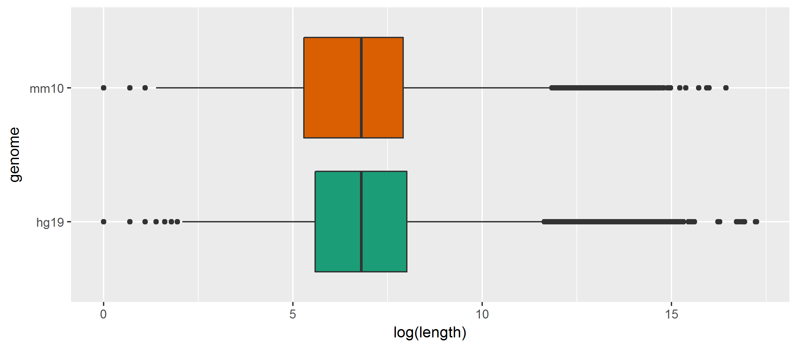

# Mouse vs Human
Ronica K  


###Mouse genome

__UCSC RepeatMasker Track__


```
## GRanges object with 5138231 ranges and 3 metadata columns:
##             seqnames                 ranges strand |        name
##                <Rle>              <IRanges>  <Rle> | <character>
##         [1]     chr1 [ 67108753,  67108881]      + |  RLTR17B_Mm
##         [2]     chr1 [134217652, 134217732]      - |      BC1_Mm
##         [3]     chr1 [  8386826,   8389555]      - |         Lx2
##         [4]     chr1 [ 16776989,  16779051]      + |     L1_Mus1
##         [5]     chr1 [ 33554409,  33554640]      - |          B4
##         ...      ...                    ...    ... .         ...
##   [5138227]    chr19   [61330641, 61330789]      - |      MLT1A0
##   [5138228]    chr19   [61330996, 61331153]      + |      RSINE1
##   [5138229]    chr19   [61331175, 61331210]      + |     AT_rich
##   [5138230]    chr19   [61331244, 61331276]      - |      MT-int
##   [5138231]    chr19   [61331281, 61331566]      + |   (TTAGGG)n
##                     class         family
##               <character>    <character>
##         [1]           LTR           ERVK
##         [2]    RNA_repeat          scRNA
##         [3]          LINE             L1
##         [4]          LINE             L1
##         [5]          SINE             B4
##         ...           ...            ...
##   [5138227]           LTR      ERVL-MaLR
##   [5138228]          SINE             B4
##   [5138229] Simple_repeat Low_complexity
##   [5138230]           LTR      ERVL-MaLR
##   [5138231] Simple_repeat  Simple_repeat
##   -------
##   seqinfo: 21 sequences from mm10 genome
```

__Number of unique repeat sequences__


```
## [1] 1554
```


###Repeats


```
##       chr              length                   class        
##  chr1   : 432854   Min.   :     6.0   DNA          : 456948  
##  chr2   : 414353   1st Qu.:    91.0   LINE         :1480369  
##  chr3   : 348034   Median :   188.0   LTR          : 708210  
##  chr4   : 321696   Mean   :   276.8   Other        :  15422  
##  chr5   : 307874   3rd Qu.:   306.0   RNA_repeat   :  11246  
##  chr6   : 286619   Max.   :160602.0   Simple_repeat: 790203  
##  (Other):3120807                      SINE         :1769839  
##             family         genome       
##  Alu           :1175329   hg19:5232237  
##  L1            : 938484                 
##  MIR           : 590625                 
##  L2            : 462077                 
##  Simple_repeat : 413380                 
##  Low_complexity: 367822                 
##  (Other)       :1284520
```

```
##       chr              length                  class        
##  chr1   : 365923   Min.   :    6.0   DNA          : 162979  
##  chr2   : 347316   1st Qu.:   61.0   LINE         : 987161  
##  chrX   : 312645   Median :  130.0   LTR          : 970384  
##  chr5   : 305982   Mean   :  233.3   Other        :  31745  
##  chr4   : 305744   3rd Qu.:  218.0   RNA_repeat   :  18770  
##  chr3   : 284304   Max.   :38417.0   Simple_repeat:1436539  
##  (Other):3216317                     SINE         :1530653  
##             family         genome       
##  Simple_repeat :1013987   mm10:5138231  
##  L1            : 903043                 
##  Alu           : 573497                 
##  ERVL-MaLR     : 454137                 
##  B4            : 397255                 
##  Low_complexity: 385853                 
##  (Other)       :1410459
```

__Number of repeats by class__


```
##                  hg19    mm10
## DNA            456948  162979
## LINE          1480369  987161
## LTR            708210  970384
## Other           15422   31745
## RNA_repeat      11246   18770
## Simple_repeat  790203 1436539
## SINE          1769839 1530653
```

__Genome covered by class__


```
##                    hg19      mm10
## DNA            98275783  29427898
## LINE          631141049 547282808
## LTR           264167042 318893375
## Other           6109487  11234257
## RNA_repeat      1119566   1539359
## Simple_repeat  55563959  84585973
## SINE          391666614 205824560
```

__Length by species__

<!-- -->


__Length by class__

__in mouse__


```
##            DNA    LINE    LTR  Other RNA_repeat Simple_repeat  SINE
## Min.      11.0    11.0   11.0   11.0      11.00          6.00  11.0
## 1st Qu.  108.0   139.0  129.0  115.0      60.00         30.00  98.0
## Median   160.0   280.0  261.0  200.0      73.00         43.00 135.0
## Mean     180.6   554.4  328.6  353.9      82.01         58.88 134.5
## 3rd Qu.  213.0   582.0  383.0  496.0      94.00         66.00 168.0
## Max.    2178.0 13490.0 8472.0 2945.0    1849.00      38420.00 517.0
```


<!-- -->

###Gaps


```
##       chr              length                   class        
##  chr1   : 404463   Min.   :       1   DNA          : 438281  
##  chr2   : 389524   1st Qu.:     267   LINE         :1371707  
##  chr3   : 326593   Median :     902   LTR          : 624620  
##  chr4   : 301584   Mean   :    4004   Other        :  15185  
##  chr5   : 288686   3rd Qu.:    3009   RNA_repeat   :  11187  
##  chr6   : 268933   Max.   :30919763   SINE         :1662701  
##  (Other):2911393                      Simple_repeat: 767495  
##   genome       
##  hg19:4891176  
##                
##                
##                
##                
##                
## 
```

```
##       chr              length                   class        
##  chr1   : 336278   Min.   :       1   DNA          : 160250  
##  chr2   : 320828   1st Qu.:     198   LINE         : 858113  
##  chr5   : 282017   Median :     902   LTR          : 849858  
##  chr4   : 280336   Mean   :    3693   Other        :  30328  
##  chrX   : 279636   3rd Qu.:    2723   RNA_repeat   :  18566  
##  chr3   : 260440   Max.   :13755247   SINE         :1442264  
##  (Other):2953877                      Simple_repeat:1354033  
##   genome       
##  mm10:4713412  
##                
##                
##                
##                
##                
## 
```

__Gap length by species__

<!-- -->

__Gap length by class__

__in mouse__


```
##             DNA   LINE    LTR   Other RNA_repeat   SINE Simple_repeat
## Min.          1      1      1       1          1      1             1
## 1st Qu.    1747    144    180     566      25040    131           363
## Median     7967    742   1044   33430      74670    590          1106
## Mean      16410   2464   2758   87000     142600   1704          1903
## 3rd Qu.   20390   2900   3431  116700     178400   1802          2477
## Max.    3187000 706900 726200 3052000   13760000 725600        655100
```

<!-- -->

